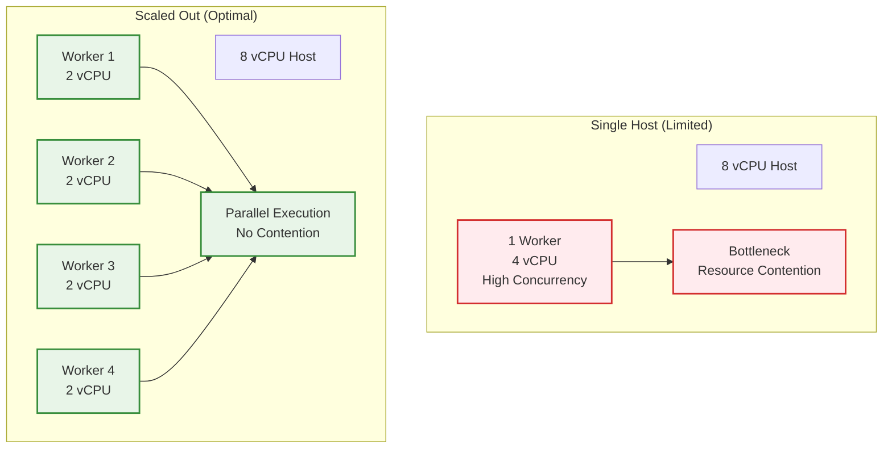
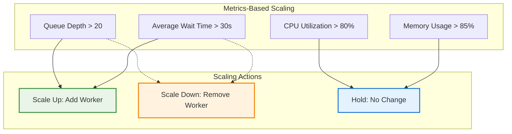
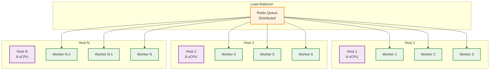

# Docker Compose Scaling Guide

## Overview

This guide provides comprehensive instructions for scaling Supercheck deployments using Docker Compose. The system is designed for **horizontal scaling** by adding more worker replicas rather than increasing individual worker capacity.

## Scaling Strategies

### Horizontal Scaling Architecture

**🚀 Scale Out, Not Up:** The system is designed for horizontal scaling by adding more worker replicas rather than increasing individual worker capacity.



### Scaling Factors

| Host Configuration | Recommended Workers | Total Capacity | CPU per Worker | Memory per Worker |
|-------------------|-------------------|----------------|----------------|------------------|
| 4 vCPU / 8 GB | 2 workers | 4 concurrent | 2 vCPU | 2 GB |
| 8 vCPU / 16 GB | 3-4 workers | 6-8 concurrent | 2 vCPU | 2 GB |
| 16 vCPU / 32 GB | 6-8 workers | 12-16 concurrent | 2 vCPU | 2 GB |
| 32 vCPU / 64 GB | 12-16 workers | 24-32 concurrent | 2 vCPU | 2 GB |

### Auto-Scaling Strategies



### Multi-Host Scaling



## Quick Start

### Basic Scaling

```bash
# Scale to 5 workers using environment variable
WORKER_REPLICAS=5 docker-compose up -d

# Scale local development
WORKER_REPLICAS=2 docker-compose -f docker-compose-local.yml up -d
```

### Environment-Based Scaling

Create a `.env.scaling` file:

```bash
# .env.scaling
WORKER_REPLICAS=4
WORKER_CPU_LIMIT=2.0
WORKER_MEMORY_LIMIT=2G
RUNNING_CAPACITY=8
QUEUED_CAPACITY=60
```

Then run:

```bash
docker-compose --env-file .env.scaling up -d
```

### Docker Compose Scaling Options

The scaling configuration is built into the main Docker Compose files:

**Production (docker-compose.yml):**
- Default: 3 workers, 6 concurrent capacity
- Configurable via `WORKER_REPLICAS` environment variable
- Scaling examples documented in file comments

**Local (docker-compose-local.yml):**
- Default: 1 worker, 2 concurrent capacity
- Configurable via `WORKER_REPLICAS` environment variable
- Lower resource limits for development

### Host-Based Scaling

| Host Configuration | Recommended Workers | Total Capacity | Environment Variables |
|-------------------|-------------------|----------------|----------------------|
| 4 vCPU / 8 GB | 2 workers | 4 concurrent | `WORKER_REPLICAS=2 RUNNING_CAPACITY=4` |
| 8 vCPU / 16 GB | 3-4 workers | 6-8 concurrent | `WORKER_REPLICAS=3 RUNNING_CAPACITY=6` |
| 16 vCPU / 32 GB | 6-8 workers | 12-16 concurrent | `WORKER_REPLICAS=6 RUNNING_CAPACITY=12` |
| 32 vCPU / 64 GB | 12-16 workers | 24-32 concurrent | `WORKER_REPLICAS=12 RUNNING_CAPACITY=24` |

### Workload-Based Scaling

#### High-Throughput Workloads
- **Many small tests**: More workers, standard memory
- **Configuration**: `WORKER_REPLICAS=8` `MAX_CONCURRENT_EXECUTIONS=3`
- **Total**: 24 concurrent capacity

#### Memory-Intensive Workloads
- **Large browser tests**: Fewer workers, more memory per worker
- **Configuration**: `WORKER_REPLICAS=4` `MAX_CONCURRENT_EXECUTIONS=1`
- **Total**: 4 concurrent capacity with 3GB per worker

### Auto-Scaling Considerations

While Docker Compose doesn't have built-in auto-scaling, you can implement it with monitoring scripts:

```bash
#!/bin/bash
# scaling-monitor.sh

# Monitor queue depth
QUEUE_DEPTH=$(redis-cli -h redis -p 6379 -a $REDIS_PASSWORD llen supercheck:queue:test-execution)
CURRENT_WORKERS=$(docker-compose ps -q worker | wc -l)

# Scale up if queue depth > 20
if [ $QUEUE_DEPTH -gt 20 ] && [ $CURRENT_WORKERS -lt 8 ]; then
    echo "Scaling up: Queue depth $QUEUE_DEPTH, current workers $CURRENT_WORKERS"
    export WORKER_REPLICAS=$((CURRENT_WORKERS + 2))
    export RUNNING_CAPACITY=$((WORKER_REPLICAS * 2))
    docker-compose up -d
fi

# Scale down if queue depth < 5
if [ $QUEUE_DEPTH -lt 5 ] && [ $CURRENT_WORKERS -gt 2 ]; then
    echo "Scaling down: Queue depth $QUEUE_DEPTH, current workers $CURRENT_WORKERS"
    export WORKER_REPLICAS=$((CURRENT_WORKERS - 1))
    export RUNNING_CAPACITY=$((WORKER_REPLICAS * 2))
    docker-compose up -d
fi
```

## Resource Management

### Worker Resource Limits

```yaml
worker:
  deploy:
    resources:
      limits:
        cpus: "2.0"          # Max 2 vCPU per worker
        memory: 2G           # Max 2GB RAM per worker
      reservations:
        cpus: "0.5"          # Guaranteed 0.5 vCPU
        memory: 1G           # Guaranteed 1GB RAM
```

### Container Security Limits

Test execution containers have these limits enforced by the ContainerExecutorService:

- **Memory**: 2048MB per test container
- **CPU**: 2 cores per test container
- **Processes**: 100 max processes
- **Shared Memory**: 512MB for browsers
- **Temporary Storage**: 512MB tmpfs

### Resource Monitoring

Monitor resource usage with:

```bash
# Check worker resource usage
docker stats $(docker-compose ps -q worker)

# Monitor queue depth
redis-cli -h redis -p 6379 -a $REDIS_PASSWORD llen supercheck:queue:test-execution

# Check running capacity
redis-cli -h redis -p 6379 -a $REDIS_PASSWORD get supercheck:capacity:running
```

## Production Deployment

### 1. Production Configuration

```bash
# docker-compose.prod.yml
version: '3.8'

services:
  worker:
    deploy:
      replicas: ${WORKER_REPLICAS:-5}
      resources:
        limits:
          cpus: "2.0"
          memory: 2G
      restart_policy:
        condition: on-failure
        max_attempts: 3
        delay: 15s
    logging:
      driver: "json-file"
      options:
        max-size: "10m"
        max-file: "3"
```

### 2. Multi-Host Deployment

For multi-host deployments, use Docker Swarm:

```yaml
# docker-compose.swarm.yml
version: '3.8'

services:
  worker:
    image: ghcr.io/supercheck-io/supercheck/worker:1.1.3-beta
    deploy:
      mode: replicated
      replicas: 10
      placement:
        max_replicas_per_node: 4
        constraints:
          - node.labels.worker == true
      resources:
        limits:
          cpus: "2.0"
          memory: 2G
```

Deploy with:

```bash
# Initialize swarm
docker swarm init

# Label worker nodes
docker node update --label-add worker=true node-1
docker node update --label-add worker=true node-2

# Deploy stack
docker stack deploy -c docker-compose.yml -c docker-compose.swarm.yml supercheck
```

## Performance Optimization

### 1. Container Optimization

```yaml
# Optimized worker configuration
worker:
  deploy:
    resources:
      limits:
        cpus: "2.0"
        memory: 2G
      reservations:
        cpus: "0.5"
        memory: 1G
  # Use tmpfs for better performance
  tmpfs:
    - /tmp:noexec,nosuid,size=1g
  # Optimize Docker daemon
  environment:
    - DOCKER_CLIENT_TIMEOUT=120
    - COMPOSE_HTTP_TIMEOUT=120
```

### 2. Network Optimization

```yaml
networks:
  supercheck-network:
    driver: bridge
    driver_opts:
      com.docker.network.bridge.name: supercheck0
      com.docker.network.driver.mtu: 1500
    ipam:
      config:
        - subnet: 172.20.0.0/16
```

### 3. Volume Optimization

```yaml
volumes:
  worker-reports:
    driver: local
    driver_opts:
      type: none
      o: bind
      device: /mnt/ssd/supercheck/reports  # Use SSD for better performance
```

## Monitoring and Alerting

### 1. Health Checks

```yaml
worker:
  healthcheck:
    test: ["CMD", "curl", "-f", "http://localhost:3001/health"]
    interval: 30s
    timeout: 10s
    retries: 3
    start_period: 60s
```

### 2. Metrics Collection

```bash
# Collect worker metrics
docker exec worker-1 npm run metrics

# Monitor queue metrics
redis-cli -h redis -p 6379 --scan --pattern "supercheck:metrics:*"

# Check container spawn times
docker logs worker-1 | grep "Container spawned"
```

### 3. Alerting Script

```bash
#!/bin/bash
# alerting.sh

# Check queue depth
QUEUE_DEPTH=$(redis-cli -h redis -p 6379 -a $REDIS_PASSWORD llen supercheck:queue:test-execution)
if [ $QUEUE_DEPTH -gt 50 ]; then
    echo "ALERT: High queue depth: $QUEUE_DEPTH"
    # Send notification
fi

# Check failed containers
FAILED_CONTAINERS=$(docker ps -a --filter "name=supercheck-test" --filter "status=exited" --format "{{.Names}}" | wc -l)
if [ $FAILED_CONTAINERS -gt 10 ]; then
    echo "ALERT: High failure rate: $FAILED_CONTAINERS failed containers"
    # Send notification
fi
```

## Troubleshooting

### Common Issues

#### 1. Workers Not Starting

```bash
# Check Docker socket permissions
ls -la /var/run/docker.sock

# Check worker logs
docker-compose logs worker

# Verify resource availability
docker system df
```

#### 2. High Memory Usage

```bash
# Check memory usage by worker
docker stats --no-stream

# Clean up unused containers
docker container prune -f

# Check for memory leaks
docker exec worker-1 node --inspect=0.0.0.0:9229 app.js
```

#### 3. Queue Backlog

```bash
# Check queue status
redis-cli -h redis -p 6379 -a $REDIS_PASSWORD info keyspace

# Monitor processing rate
watch -n 1 'redis-cli -h redis -p 6379 -a $REDIS_PASSWORD get supercheck:capacity:running'

# Scale workers if needed
WORKER_REPLICAS=6 RUNNING_CAPACITY=12 docker-compose up -d
```

## Best Practices

### 1. Scaling Best Practices

- **Scale horizontally**, not vertically
- **Monitor resource usage** before scaling
- **Use predefined profiles** for consistent deployments
- **Implement health checks** for all services
- **Set appropriate resource limits** to prevent resource contention

### 2. Production Best Practices

- **Use read-only Docker socket** (`:ro`)
- **Implement comprehensive logging** with rotation
- **Use security profiles** (AppArmor, seccomp)
- **Monitor container lifecycle** metrics
- **Implement backup strategies** for volumes

### 3. Performance Best Practices

- **Use SSD storage** for volumes
- **Optimize network configuration**
- **Monitor container spawn times**
- **Implement proper cleanup** strategies
- **Use resource reservations** for QoS

## Example Deployments

### Small Development Setup

```bash
# 2 workers, 4 concurrent tests
WORKER_REPLICAS=2 docker-compose -f docker-compose-local.yml up -d
```

### Medium Production Setup

```bash
# 4 workers, 8 concurrent tests
WORKER_REPLICAS=4 RUNNING_CAPACITY=8 docker-compose up -d
```

### Large Enterprise Setup

```bash
# 8 workers, 16 concurrent tests
WORKER_REPLICAS=8 RUNNING_CAPACITY=16 docker-compose up -d
```

### High-Throughput Setup

```bash
# Optimized for many small tests
WORKER_REPLICAS=8 MAX_CONCURRENT_EXECUTIONS=3 RUNNING_CAPACITY=24 docker-compose up -d
```

### Memory-Intensive Setup

```bash
# Optimized for large browser tests
WORKER_REPLICAS=4 MAX_CONCURRENT_EXECUTIONS=1 RUNNING_CAPACITY=4 docker-compose up -d
```

## Environment Variables

| Variable | Default | Description |
|----------|---------|-------------|
| `WORKER_REPLICAS` | 3 | Number of worker replicas |
| `WORKER_CPU_LIMIT` | 2.0 | CPU limit per worker |
| `WORKER_MEMORY_LIMIT` | 2G | Memory limit per worker |
| `RUNNING_CAPACITY` | 6 | Total concurrent test capacity |
| `QUEUED_CAPACITY` | 50 | Maximum queue size |
| `MAX_CONCURRENT_EXECUTIONS` | 2 | Concurrent tests per worker |

## Next Steps

1. **Monitor your deployment** using the provided scripts
2. **Adjust scaling parameters** based on your workload
3. **Implement automated scaling** if needed
4. **Set up monitoring and alerting** for production
5. **Review performance metrics** regularly

For more information, see:
- [Test Execution Flow](TEST_EXECUTION_AND_JOB_QUEUE_FLOW.md)
- [Security Documentation](SECURITY_IMPLEMENTATION_PLAN.md)
- [Observability Guide](OBSERVABILITY.md)
