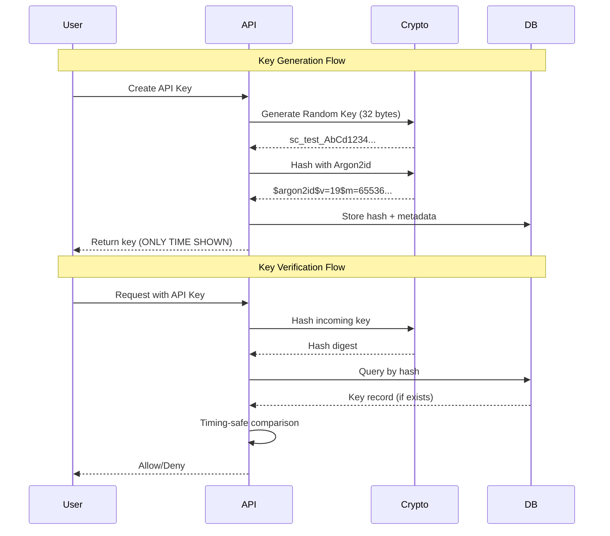
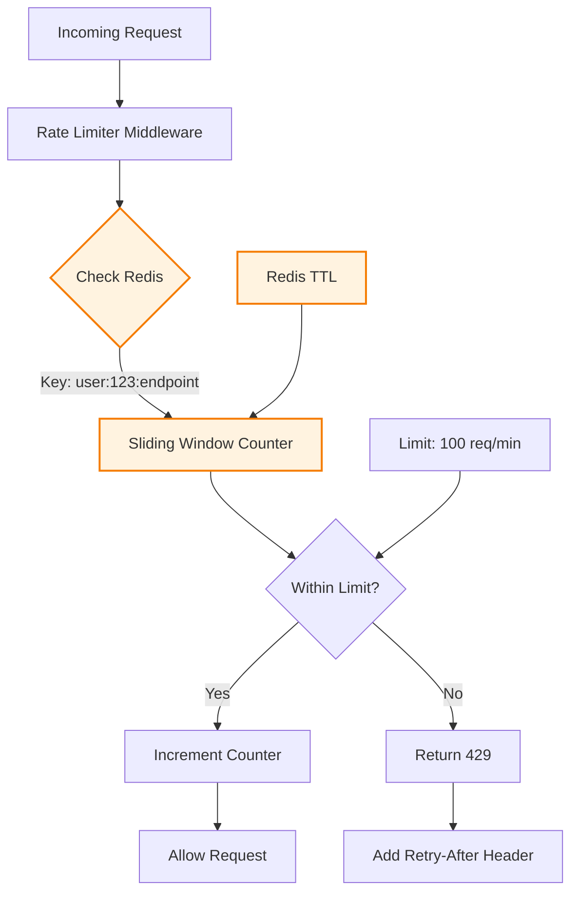
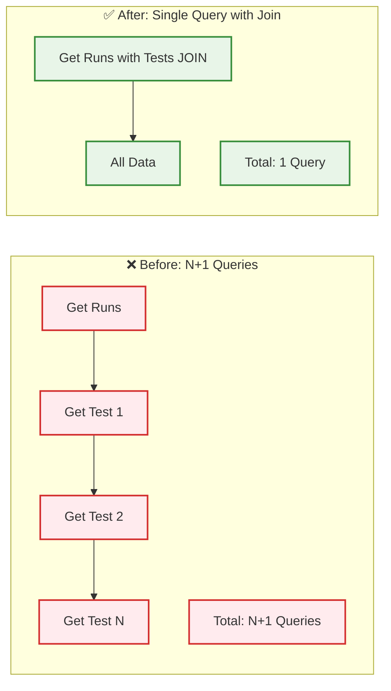
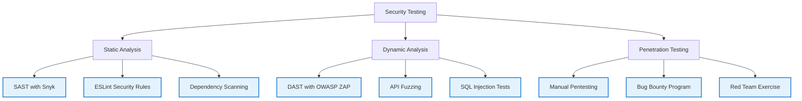
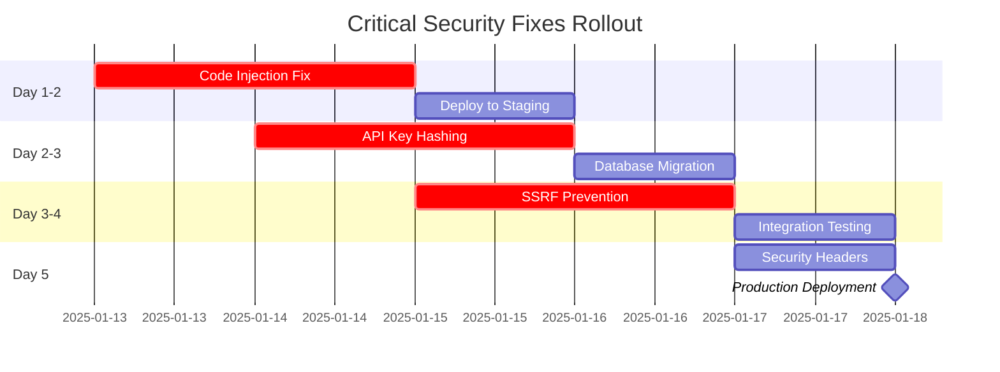
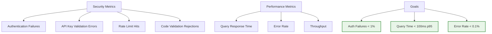

# Security Implementation Plan

## Executive Summary

This document provides **detailed code implementations** for fixing the 37 identified security and scalability issues. Each fix includes production-ready code examples, migration strategies, and testing approaches.

**Current Status:** ✅ **Issue #1 (Code Injection) FULLY RESOLVED** - Container execution deployed

**Timeline:** Critical fixes within 1 week, High priority within 1 month, Medium within 1 quarter.

**Latest Update:** 2025-01-14 - Container-based execution fully implemented and deployed

---

## Table of Contents

1. [Critical Security Fixes](#critical-security-fixes)
2. [High Priority Security Fixes](#high-priority-security-fixes)
3. [Scalability Improvements](#scalability-improvements)
4. [Testing Strategy](#testing-strategy)
5. [Deployment Plan](#deployment-plan)

---

## Critical Security Fixes

### Fix #1: Code Injection Prevention (RCE)

**Implementation Status:** ✅ **FULLY IMPLEMENTED AND DEPLOYED**

**Implementation Date:** 2025-01-13
**Solution Applied:** Container-based execution with Docker isolation

**What was implemented:**
1. ✅ **Mandatory container execution** for all Playwright and K6 tests
2. ✅ **No fallback to local execution** - containers are required, not optional
3. ✅ **Security hardening:**
   - Read-only root filesystem (`--read-only`)
   - No privilege escalation (`--security-opt=no-new-privileges`)
   - All capabilities dropped (`--cap-drop=ALL`)
   - Resource limits (CPU, memory, PIDs)
   - Network isolation
4. ✅ **Docker images:**
   - Playwright: `mcr.microsoft.com/playwright:v1.56.1-noble`
   - K6: `grafana/k6:latest`
5. ✅ **Path isolation:** Worker directory mounted at `/workspace` with proper path mapping
6. ✅ **Environment variable security:** Container paths used throughout
7. ✅ **K6 threshold detection:** Fixed to use actual threshold results from summary.json

**Security benefits achieved:**
- ✅ Prevents Remote Code Execution (RCE) attacks
- ✅ Isolated execution environment with no host access
- ✅ Resource exhaustion protection
- ✅ Consistent, reproducible test environments
- ✅ Defense-in-depth security posture

**Files modified:**
- `worker/src/common/security/container-executor.service.ts` - Core container execution
- `worker/src/execution/services/execution.service.ts` - Playwright execution
- `worker/src/k6/services/k6-execution.service.ts` - K6 execution

**Documentation:**
- See `specs/TEST_EXECUTION_AND_JOB_QUEUE_FLOW.md` - Container-Based Execution section

---

### Fix #2: API Key Hashing

**Priority:** 🔴 CRITICAL - Implement within 48 hours

**Solution Architecture:**



**Implementation:**

**Step 1: Create API Key Service** (`app/src/lib/security/api-key-service.ts`)

```typescript
import { randomBytes, timingSafeEqual } from 'crypto';
import argon2 from 'argon2';

export interface ApiKeyMetadata {
  keyHash: string;
  prefix: string; // For identification: "sc_test_", "sc_live_"
  lastFourDigits: string; // For display: "...Ab12"
  projectId: string;
  createdAt: Date;
  lastUsedAt?: Date;
  expiresAt?: Date;
}

export class ApiKeyService {
  private static readonly KEY_LENGTH = 32;
  private static readonly ARGON2_OPTIONS = {
    type: argon2.argon2id,
    memoryCost: 65536, // 64 MB
    timeCost: 3,
    parallelism: 4
  };

  /**
   * Generate new API key
   * Format: sc_{env}_{32_char_random}
   */
  static async generateApiKey(
    projectId: string,
    environment: 'test' | 'live'
  ): Promise<{ key: string; metadata: ApiKeyMetadata }> {

    // Generate cryptographically random key
    const randomPart = randomBytes(this.KEY_LENGTH)
      .toString('base64url')
      .slice(0, 32);

    const prefix = `sc_${environment}_`;
    const key = `${prefix}${randomPart}`;

    // Hash for storage
    const keyHash = await this.hashApiKey(key);

    // Extract last 4 chars for display
    const lastFourDigits = key.slice(-4);

    const metadata: ApiKeyMetadata = {
      keyHash,
      prefix,
      lastFourDigits,
      projectId,
      createdAt: new Date(),
      expiresAt: null // No expiry by default
    };

    return { key, metadata };
  }

  /**
   * Hash API key using Argon2id
   */
  static async hashApiKey(key: string): Promise<string> {
    return argon2.hash(key, this.ARGON2_OPTIONS);
  }

  /**
   * Verify API key against stored hash
   * Uses timing-safe comparison
   */
  static async verifyApiKey(
    providedKey: string,
    storedHash: string
  ): Promise<boolean> {
    try {
      return await argon2.verify(storedHash, providedKey);
    } catch (error) {
      // Invalid hash format or verification error
      return false;
    }
  }

  /**
   * Extract prefix for quick lookup optimization
   */
  static extractPrefix(key: string): string | null {
    const match = key.match(/^(sc_(test|live)_)/);
    return match ? match[1] : null;
  }
}
```

**Step 2: Update API Key Creation Endpoint** (`app/src/app/api/projects/[projectId]/keys/route.ts`)

```typescript
import { NextRequest, NextResponse } from 'next/server';
import { ApiKeyService } from '@/lib/security/api-key-service';
import { db } from '@/lib/db';
import { apiKeys } from '@/lib/db/schema';

export async function POST(
  req: NextRequest,
  { params }: { params: { projectId: string } }
) {
  const session = await getSession(req);
  if (!session) {
    return NextResponse.json({ error: 'Unauthorized' }, { status: 401 });
  }

  // Check permissions
  const hasAccess = await checkProjectAccess(
    session.user.id,
    params.projectId,
    'admin'
  );

  if (!hasAccess) {
    return NextResponse.json({ error: 'Forbidden' }, { status: 403 });
  }

  const body = await req.json();
  const { name, environment = 'test' } = body;

  // Generate new API key
  const { key, metadata } = await ApiKeyService.generateApiKey(
    params.projectId,
    environment
  );

  // Store ONLY the hash
  await db.insert(apiKeys).values({
    id: generateId(),
    projectId: params.projectId,
    name,
    keyHash: metadata.keyHash, // NEVER store plain key!
    prefix: metadata.prefix,
    lastFourDigits: metadata.lastFourDigits,
    createdAt: metadata.createdAt,
    createdBy: session.user.id,
    expiresAt: metadata.expiresAt
  });

  // Return key ONLY ONCE
  return NextResponse.json({
    key, // User must save this!
    lastFourDigits: metadata.lastFourDigits,
    warning: 'This is the only time this key will be shown. Save it securely.'
  });
}
```

**Step 3: Update Verification Endpoint** (`app/src/app/api/auth/verify-key/route.ts`)

```typescript
import { NextRequest, NextResponse } from 'next/server';
import { ApiKeyService } from '@/lib/security/api-key-service';
import { db } from '@/lib/db';
import { apiKeys } from '@/lib/db/schema';
import { eq, and } from 'drizzle-orm';

export async function POST(req: NextRequest) {
  const authHeader = req.headers.get('authorization');

  if (!authHeader || !authHeader.startsWith('Bearer ')) {
    return NextResponse.json(
      { error: 'Missing or invalid authorization header' },
      { status: 401 }
    );
  }

  const providedKey = authHeader.slice(7); // Remove "Bearer "

  // Extract prefix for optimized lookup
  const prefix = ApiKeyService.extractPrefix(providedKey);

  if (!prefix) {
    return NextResponse.json(
      { error: 'Invalid API key format' },
      { status: 401 }
    );
  }

  // Query by prefix first (indexed)
  const keyRecords = await db
    .select()
    .from(apiKeys)
    .where(
      and(
        eq(apiKeys.prefix, prefix),
        eq(apiKeys.deletedAt, null)
      )
    );

  // Verify against all matching prefixes (timing-safe)
  for (const record of keyRecords) {
    const isValid = await ApiKeyService.verifyApiKey(
      providedKey,
      record.keyHash
    );

    if (isValid) {
      // Check expiration
      if (record.expiresAt && new Date() > record.expiresAt) {
        return NextResponse.json(
          { error: 'API key expired' },
          { status: 401 }
        );
      }

      // Update last used timestamp (async, don't await)
      db.update(apiKeys)
        .set({ lastUsedAt: new Date() })
        .where(eq(apiKeys.id, record.id))
        .execute()
        .catch(console.error);

      return NextResponse.json({
        valid: true,
        projectId: record.projectId,
        keyId: record.id
      });
    }
  }

  // No match found - timing safe delay
  await new Promise(resolve => setTimeout(resolve, 100));

  return NextResponse.json(
    { error: 'Invalid API key' },
    { status: 401 }
  );
}
```

**Step 4: Database Migration** (`app/drizzle/migrations/0003_api_key_hashing.sql`)

```sql
-- Add new columns for hashing
ALTER TABLE api_keys
  ADD COLUMN key_hash TEXT,
  ADD COLUMN prefix VARCHAR(20),
  ADD COLUMN last_four_digits VARCHAR(4);

-- Create index on prefix for fast lookup
CREATE INDEX idx_api_keys_prefix ON api_keys(prefix) WHERE deleted_at IS NULL;

-- Migration script to hash existing keys (if any)
-- NOTE: Existing plain-text keys cannot be hashed without the original key
-- Options:
-- 1. Force regeneration for all users (RECOMMENDED)
-- 2. Support both methods temporarily with deprecation notice

-- Mark all existing keys as requiring rotation
UPDATE api_keys
SET expires_at = NOW() + INTERVAL '7 days'
WHERE key_hash IS NULL;

-- After migration period, make key_hash NOT NULL
ALTER TABLE api_keys
  ALTER COLUMN key_hash SET NOT NULL,
  DROP COLUMN key; -- Remove plain text column entirely
```

**Testing:**

```typescript
// test/security/api-key-service.test.ts
import { describe, it, expect } from 'vitest';
import { ApiKeyService } from '@/lib/security/api-key-service';

describe('ApiKeyService', () => {
  it('should generate unique keys', async () => {
    const { key: key1 } = await ApiKeyService.generateApiKey('proj1', 'test');
    const { key: key2 } = await ApiKeyService.generateApiKey('proj1', 'test');

    expect(key1).not.toBe(key2);
    expect(key1).toMatch(/^sc_test_/);
  });

  it('should verify correct keys', async () => {
    const { key, metadata } = await ApiKeyService.generateApiKey('proj1', 'test');
    const isValid = await ApiKeyService.verifyApiKey(key, metadata.keyHash);

    expect(isValid).toBe(true);
  });

  it('should reject incorrect keys', async () => {
    const { metadata } = await ApiKeyService.generateApiKey('proj1', 'test');
    const isValid = await ApiKeyService.verifyApiKey('sc_test_wrong', metadata.keyHash);

    expect(isValid).toBe(false);
  });

  it('should be timing-safe', async () => {
    const { key, metadata } = await ApiKeyService.generateApiKey('proj1', 'test');

    // Both should take similar time
    const start1 = Date.now();
    await ApiKeyService.verifyApiKey(key, metadata.keyHash);
    const time1 = Date.now() - start1;

    const start2 = Date.now();
    await ApiKeyService.verifyApiKey('sc_test_wrong', metadata.keyHash);
    const time2 = Date.now() - start2;

    // Should be within 20% of each other
    expect(Math.abs(time1 - time2) / Math.max(time1, time2)).toBeLessThan(0.2);
  });
});
```

---

### Fix #3: SSRF Prevention

**Priority:** 🔴 CRITICAL - Implement within 72 hours

**Implementation:** (`worker/src/monitor/ssrf-validator.ts`)

```typescript
import { isIP } from 'net';
import { lookup } from 'dns/promises';

const BLOCKED_IP_RANGES = [
  // Loopback
  '127.0.0.0/8',
  '::1/128',

  // Private networks
  '10.0.0.0/8',
  '172.16.0.0/12',
  '192.168.0.0/16',
  'fc00::/7',

  // Cloud metadata
  '169.254.169.254/32', // AWS, Azure, GCP
  'fd00:ec2::254/128',  // AWS IPv6

  // Link-local
  '169.254.0.0/16',
  'fe80::/10'
];

export class SSRFValidator {

  /**
   * Validate URL is safe for outbound requests
   */
  static async validateUrl(url: string, allowInternal = false): Promise<void> {
    const parsed = new URL(url);

    // Only allow HTTP(S)
    if (!['http:', 'https:'].includes(parsed.protocol)) {
      throw new Error(`Protocol not allowed: ${parsed.protocol}`);
    }

    // Resolve DNS
    const hostname = parsed.hostname;
    const addresses = await this.resolveHostname(hostname);

    // Check all resolved IPs
    for (const address of addresses) {
      if (!allowInternal && this.isPrivateOrMetadata(address)) {
        throw new Error(
          `Access to private/metadata IP blocked: ${address}`
        );
      }
    }

    // Check for DNS rebinding by resolving again
    const secondResolve = await this.resolveHostname(hostname);
    if (!this.arraysEqual(addresses, secondResolve)) {
      throw new Error('DNS rebinding detected');
    }
  }

  private static async resolveHostname(hostname: string): Promise<string[]> {
    try {
      const result = await lookup(hostname, { all: true });
      return result.map(r => r.address);
    } catch (error) {
      throw new Error(`DNS resolution failed: ${error.message}`);
    }
  }

  private static isPrivateOrMetadata(ip: string): boolean {
    // Check if IP is in blocked ranges
    for (const range of BLOCKED_IP_RANGES) {
      if (this.ipInRange(ip, range)) {
        return true;
      }
    }
    return false;
  }

  private static ipInRange(ip: string, range: string): boolean {
    // Implementation of CIDR matching
    // Use ip-range-check or similar library
    const ipRangeCheck = require('ip-range-check');
    return ipRangeCheck(ip, range);
  }

  private static arraysEqual(a: string[], b: string[]): boolean {
    return a.length === b.length &&
           a.every((val, idx) => val === b[idx]);
  }
}
```

**Updated Monitor Service:** (`worker/src/monitor/monitor.service.ts`)

```typescript
import { SSRFValidator } from './ssrf-validator';

export class MonitorService {

  async checkMonitor(monitor: Monitor): Promise<MonitorResult> {
    // CRITICAL: Validate URL before making request
    try {
      // Remove ALLOW_INTERNAL_TARGETS bypass entirely
      // Only allow internal for specific admin-approved monitors
      const allowInternal = await this.isAdminApproved(monitor.id);

      await SSRFValidator.validateUrl(monitor.url, allowInternal);
    } catch (error) {
      return {
        status: 'error',
        message: `URL validation failed: ${error.message}`,
        timestamp: new Date()
      };
    }

    // Make request with additional safeguards
    const response = await this.makeSecureRequest(monitor.url);
    return this.processResponse(response);
  }

  private async makeSecureRequest(url: string): Promise<Response> {
    return fetch(url, {
      method: 'GET',
      redirect: 'manual', // Don't follow redirects automatically
      headers: {
        'User-Agent': 'Supercheck-Monitor/1.0'
      },
      signal: AbortSignal.timeout(10000) // 10s timeout
    });
  }
}
```

---

### Fix #4: Upgrade Encryption to AES-256

**Priority:** 🔴 CRITICAL - Implement within 1 week

**Implementation:** (`app/src/lib/security/secret-crypto-v2.ts`)

```typescript
import { randomBytes, createCipheriv, createDecipheriv } from 'crypto';
import { scrypt } from 'crypto';
import { promisify } from 'util';

const scryptAsync = promisify(scrypt);

export class SecretCryptoV2 {
  private static readonly ALGORITHM = 'aes-256-gcm';
  private static readonly KEY_LENGTH = 32; // 256 bits
  private static readonly IV_LENGTH = 16;
  private static readonly AUTH_TAG_LENGTH = 16;
  private static readonly SALT_LENGTH = 32;
  private static readonly SCRYPT_N = 2 ** 17; // 131072 iterations
  private static readonly SCRYPT_R = 8;
  private static readonly SCRYPT_P = 1;

  /**
   * Derive encryption key from master key + project-specific salt
   */
  private static async deriveKey(
    masterKey: string,
    salt: Buffer,
    projectId: string
  ): Promise<Buffer> {
    // Include project ID in derivation for key isolation
    const input = `${masterKey}:${projectId}`;

    return (await scryptAsync(
      input,
      salt,
      this.KEY_LENGTH,
      {
        N: this.SCRYPT_N,
        r: this.SCRYPT_R,
        p: this.SCRYPT_P,
        maxmem: 256 * 1024 * 1024 // 256 MB
      }
    )) as Buffer;
  }

  /**
   * Encrypt secret with AES-256-GCM
   * Returns: base64(version:salt:iv:authTag:ciphertext)
   */
  static async encrypt(
    plaintext: string,
    projectId: string
  ): Promise<string> {
    const masterKey = process.env.ENCRYPTION_MASTER_KEY;
    if (!masterKey) {
      throw new Error('ENCRYPTION_MASTER_KEY not configured');
    }

    // Generate random salt and IV
    const salt = randomBytes(this.SALT_LENGTH);
    const iv = randomBytes(this.IV_LENGTH);

    // Derive project-specific key
    const key = await this.deriveKey(masterKey, salt, projectId);

    // Encrypt
    const cipher = createCipheriv(this.ALGORITHM, key, iv);
    const ciphertext = Buffer.concat([
      cipher.update(plaintext, 'utf8'),
      cipher.final()
    ]);

    // Get authentication tag
    const authTag = cipher.getAuthTag();

    // Combine all parts with version prefix
    const version = Buffer.from([0x02]); // Version 2
    const combined = Buffer.concat([
      version,
      salt,
      iv,
      authTag,
      ciphertext
    ]);

    return combined.toString('base64');
  }

  /**
   * Decrypt secret
   */
  static async decrypt(
    encrypted: string,
    projectId: string
  ): Promise<string> {
    const masterKey = process.env.ENCRYPTION_MASTER_KEY;
    if (!masterKey) {
      throw new Error('ENCRYPTION_MASTER_KEY not configured');
    }

    const combined = Buffer.from(encrypted, 'base64');

    // Extract version
    const version = combined[0];

    if (version === 0x02) {
      // Version 2: AES-256-GCM
      return this.decryptV2(combined, projectId, masterKey);
    } else if (version === 0x01) {
      // Version 1: Legacy AES-128 (for migration)
      return this.decryptV1Legacy(combined, projectId, masterKey);
    } else {
      throw new Error(`Unsupported encryption version: ${version}`);
    }
  }

  private static async decryptV2(
    combined: Buffer,
    projectId: string,
    masterKey: string
  ): Promise<string> {
    let offset = 1; // Skip version byte

    // Extract components
    const salt = combined.slice(offset, offset + this.SALT_LENGTH);
    offset += this.SALT_LENGTH;

    const iv = combined.slice(offset, offset + this.IV_LENGTH);
    offset += this.IV_LENGTH;

    const authTag = combined.slice(offset, offset + this.AUTH_TAG_LENGTH);
    offset += this.AUTH_TAG_LENGTH;

    const ciphertext = combined.slice(offset);

    // Derive key
    const key = await this.deriveKey(masterKey, salt, projectId);

    // Decrypt
    const decipher = createDecipheriv(this.ALGORITHM, key, iv);
    decipher.setAuthTag(authTag);

    const plaintext = Buffer.concat([
      decipher.update(ciphertext),
      decipher.final()
    ]);

    return plaintext.toString('utf8');
  }

  /**
   * Legacy decryption for migration
   */
  private static async decryptV1Legacy(
    combined: Buffer,
    projectId: string,
    masterKey: string
  ): Promise<string> {
    // Import old SecretCrypto for migration
    const SecretCryptoV1 = require('./secret-crypto-v1');
    return SecretCryptoV1.decrypt(combined.slice(1).toString('base64'));
  }

  /**
   * Migrate secret from V1 to V2
   */
  static async migrateSecret(
    oldEncrypted: string,
    projectId: string
  ): Promise<string> {
    // Decrypt with V1
    const plaintext = await this.decryptV1Legacy(
      Buffer.from(oldEncrypted, 'base64'),
      projectId,
      process.env.ENCRYPTION_MASTER_KEY!
    );

    // Re-encrypt with V2
    return this.encrypt(plaintext, projectId);
  }
}
```

**Migration Script:** (`scripts/migrate-encryption.ts`)

```typescript
import { db } from '../app/src/lib/db';
import { secrets } from '../app/src/lib/db/schema';
import { SecretCryptoV2 } from '../app/src/lib/security/secret-crypto-v2';

async function migrateEncryption() {
  console.log('Starting encryption migration...');

  const allSecrets = await db.select().from(secrets);
  let migrated = 0;
  let failed = 0;

  for (const secret of allSecrets) {
    try {
      // Check if already V2
      const encrypted = Buffer.from(secret.encryptedValue, 'base64');
      if (encrypted[0] === 0x02) {
        console.log(`Secret ${secret.id} already migrated`);
        continue;
      }

      // Migrate to V2
      const newEncrypted = await SecretCryptoV2.migrateSecret(
        secret.encryptedValue,
        secret.projectId
      );

      // Update database
      await db
        .update(secrets)
        .set({ encryptedValue: newEncrypted })
        .where(eq(secrets.id, secret.id));

      migrated++;
      console.log(`Migrated secret ${secret.id}`);

    } catch (error) {
      failed++;
      console.error(`Failed to migrate secret ${secret.id}:`, error);
    }
  }

  console.log(`Migration complete: ${migrated} migrated, ${failed} failed`);
}

migrateEncryption().catch(console.error);
```

---

## High Priority Security Fixes

### Fix #5: Redis-Based Rate Limiting

**Priority:** 🟠 HIGH - Implement within 1 week

**Architecture:**



**Implementation:** (`app/src/lib/rate-limiting/redis-rate-limiter.ts`)

```typescript
import { Redis } from 'ioredis';

export interface RateLimitConfig {
  points: number; // Number of requests
  duration: number; // Time window in seconds
  blockDuration?: number; // Penalty duration
}

export interface RateLimitResult {
  allowed: boolean;
  remaining: number;
  resetTime: Date;
  retryAfter?: number;
}

export class RedisRateLimiter {
  private redis: Redis;

  constructor(redisUrl: string) {
    this.redis = new Redis(redisUrl);
  }

  /**
   * Check and consume rate limit
   * Uses sliding window algorithm
   */
  async checkLimit(
    key: string,
    config: RateLimitConfig
  ): Promise<RateLimitResult> {
    const now = Date.now();
    const windowStart = now - (config.duration * 1000);
    const redisKey = `ratelimit:${key}`;

    // Use Redis Lua script for atomic operation
    const script = `
      local key = KEYS[1]
      local now = tonumber(ARGV[1])
      local window_start = tonumber(ARGV[2])
      local limit = tonumber(ARGV[3])
      local ttl = tonumber(ARGV[4])

      -- Remove old entries
      redis.call('ZREMRANGEBYSCORE', key, '-inf', window_start)

      -- Count current requests
      local current = redis.call('ZCARD', key)

      if current < limit then
        -- Add new request
        redis.call('ZADD', key, now, now)
        redis.call('EXPIRE', key, ttl)
        return {1, limit - current - 1, ttl}
      else
        -- Get oldest request time for reset calculation
        local oldest = redis.call('ZRANGE', key, 0, 0, 'WITHSCORES')
        local reset = tonumber(oldest[2]) + (ttl * 1000)
        local retry = math.ceil((reset - now) / 1000)
        return {0, 0, retry}
      end
    `;

    const result = await this.redis.eval(
      script,
      1,
      redisKey,
      now,
      windowStart,
      config.points,
      config.duration
    ) as [number, number, number];

    const [allowed, remaining, retryOrReset] = result;

    return {
      allowed: allowed === 1,
      remaining,
      resetTime: new Date(now + (config.duration * 1000)),
      retryAfter: allowed === 0 ? retryOrReset : undefined
    };
  }

  /**
   * Get rate limit configs for different endpoints
   */
  static getConfig(endpoint: string): RateLimitConfig {
    const configs: Record<string, RateLimitConfig> = {
      // Authentication endpoints - strict limits
      '/api/auth/signin': { points: 5, duration: 60, blockDuration: 300 },
      '/api/auth/signup': { points: 3, duration: 3600 },
      '/api/auth/verify-key': { points: 10, duration: 60 },

      // API endpoints - per-tier limits
      '/api/runs': { points: 100, duration: 60 },
      '/api/tests': { points: 100, duration: 60 },

      // Public endpoints - generous limits
      '/api/status': { points: 1000, duration: 60 },

      // Default for unlisted endpoints
      'default': { points: 60, duration: 60 }
    };

    return configs[endpoint] || configs['default'];
  }
}
```

**Middleware:** (`app/src/middleware/rate-limit.ts`)

```typescript
import { NextRequest, NextResponse } from 'next/server';
import { RedisRateLimiter } from '@/lib/rate-limiting/redis-rate-limiter';

const rateLimiter = new RedisRateLimiter(process.env.REDIS_URL!);

export async function rateLimitMiddleware(req: NextRequest) {
  const pathname = req.nextUrl.pathname;

  // Get identifier (user ID or IP)
  const identifier = await getIdentifier(req);

  // Get config for endpoint
  const config = RedisRateLimiter.getConfig(pathname);

  // Check limit
  const result = await rateLimiter.checkLimit(
    `${identifier}:${pathname}`,
    config
  );

  // Add rate limit headers
  const headers = new Headers({
    'X-RateLimit-Limit': config.points.toString(),
    'X-RateLimit-Remaining': result.remaining.toString(),
    'X-RateLimit-Reset': result.resetTime.toISOString()
  });

  if (!result.allowed) {
    headers.set('Retry-After', result.retryAfter!.toString());

    return NextResponse.json(
      {
        error: 'Rate limit exceeded',
        retryAfter: result.retryAfter
      },
      {
        status: 429,
        headers
      }
    );
  }

  // Add headers to response
  return NextResponse.next({ headers });
}

async function getIdentifier(req: NextRequest): Promise<string> {
  // Try session first
  const session = await getSession(req);
  if (session?.user) {
    return `user:${session.user.id}`;
  }

  // Try API key
  const apiKey = req.headers.get('authorization');
  if (apiKey) {
    return `apikey:${hashString(apiKey)}`;
  }

  // Fall back to IP (less reliable, but better than nothing)
  const ip = req.headers.get('x-forwarded-for') ||
             req.headers.get('x-real-ip') ||
             'unknown';
  return `ip:${ip}`;
}
```

---

### Fix #6: CSRF Protection

**Priority:** 🟠 HIGH - Implement within 1 week

**Implementation:** (`app/src/lib/security/csrf.ts`)

```typescript
import { randomBytes, createHmac } from 'crypto';

export class CSRFProtection {
  private static readonly SECRET = process.env.CSRF_SECRET || '';
  private static readonly TOKEN_LENGTH = 32;
  private static readonly MAX_AGE = 3600; // 1 hour

  /**
   * Generate CSRF token
   * Format: timestamp:signature
   */
  static generateToken(sessionId: string): string {
    const timestamp = Date.now();
    const random = randomBytes(this.TOKEN_LENGTH).toString('hex');
    const payload = `${timestamp}:${sessionId}:${random}`;

    const signature = createHmac('sha256', this.SECRET)
      .update(payload)
      .digest('hex');

    return Buffer.from(`${payload}:${signature}`).toString('base64url');
  }

  /**
   * Verify CSRF token
   */
  static verifyToken(token: string, sessionId: string): boolean {
    try {
      const decoded = Buffer.from(token, 'base64url').toString();
      const [timestamp, tokenSessionId, random, signature] = decoded.split(':');

      // Check session match
      if (tokenSessionId !== sessionId) {
        return false;
      }

      // Check age
      const age = Date.now() - parseInt(timestamp);
      if (age > this.MAX_AGE * 1000) {
        return false;
      }

      // Verify signature
      const payload = `${timestamp}:${tokenSessionId}:${random}`;
      const expectedSignature = createHmac('sha256', this.SECRET)
        .update(payload)
        .digest('hex');

      return signature === expectedSignature;

    } catch (error) {
      return false;
    }
  }
}
```

**API Route:** (`app/src/app/api/csrf-token/route.ts`)

```typescript
import { NextRequest, NextResponse } from 'next/server';
import { CSRFProtection } from '@/lib/security/csrf';
import { getSession } from '@/lib/auth';

export async function GET(req: NextRequest) {
  const session = await getSession(req);

  if (!session) {
    return NextResponse.json({ error: 'Unauthorized' }, { status: 401 });
  }

  const token = CSRFProtection.generateToken(session.session.id);

  const response = NextResponse.json({ token });

  // Set token in cookie as well (double-submit pattern)
  response.cookies.set('csrf-token', token, {
    httpOnly: true,
    secure: process.env.NODE_ENV === 'production',
    sameSite: 'strict',
    maxAge: 3600
  });

  return response;
}
```

**Middleware:** (`app/src/middleware/csrf.ts`)

```typescript
import { NextRequest, NextResponse } from 'next/server';
import { CSRFProtection } from '@/lib/security/csrf';

export async function csrfMiddleware(req: NextRequest) {
  // Only check state-changing methods
  if (!['POST', 'PUT', 'DELETE', 'PATCH'].includes(req.method)) {
    return NextResponse.next();
  }

  const session = await getSession(req);
  if (!session) {
    // No session = no CSRF check needed
    return NextResponse.next();
  }

  // Get token from header and cookie
  const headerToken = req.headers.get('x-csrf-token');
  const cookieToken = req.cookies.get('csrf-token')?.value;

  if (!headerToken || !cookieToken) {
    return NextResponse.json(
      { error: 'CSRF token missing' },
      { status: 403 }
    );
  }

  // Verify both tokens match and are valid
  if (headerToken !== cookieToken) {
    return NextResponse.json(
      { error: 'CSRF token mismatch' },
      { status: 403 }
    );
  }

  if (!CSRFProtection.verifyToken(headerToken, session.session.id)) {
    return NextResponse.json(
      { error: 'Invalid CSRF token' },
      { status: 403 }
    );
  }

  return NextResponse.next();
}
```

---

### Fix #7: Security Headers

**Priority:** 🟠 HIGH - Implement within 2 days

**Implementation:** (`app/src/middleware/security-headers.ts`)

```typescript
import { NextResponse } from 'next/server';
import type { NextRequest } from 'next/server';

export function securityHeadersMiddleware(req: NextRequest) {
  const response = NextResponse.next();

  // Content Security Policy
  const csp = [
    "default-src 'self'",
    "script-src 'self' 'unsafe-inline' 'unsafe-eval'", // Adjust based on needs
    "style-src 'self' 'unsafe-inline'",
    "img-src 'self' data: https:",
    "font-src 'self' data:",
    "connect-src 'self' https://api.supercheck.io",
    "frame-ancestors 'none'",
    "base-uri 'self'",
    "form-action 'self'"
  ].join('; ');

  response.headers.set('Content-Security-Policy', csp);

  // Strict Transport Security
  response.headers.set(
    'Strict-Transport-Security',
    'max-age=31536000; includeSubDomains; preload'
  );

  // Prevent clickjacking
  response.headers.set('X-Frame-Options', 'DENY');

  // Prevent MIME sniffing
  response.headers.set('X-Content-Type-Options', 'nosniff');

  // Referrer policy
  response.headers.set(
    'Referrer-Policy',
    'strict-origin-when-cross-origin'
  );

  // Permissions policy
  response.headers.set(
    'Permissions-Policy',
    'geolocation=(), microphone=(), camera=()'
  );

  // Remove powered-by header
  response.headers.delete('X-Powered-By');

  return response;
}
```

---

## Scalability Improvements

### Fix #8: N+1 Query Resolution

**Priority:** 🟠 HIGH - Implement within 2 weeks

**Architecture:**



**Implementation:** (`app/src/lib/db/queries/runs.ts`)

```typescript
import { db } from '../index';
import { runs, tests, projects } from '../schema';
import { eq, and, desc } from 'drizzle-orm';

// ❌ BAD: N+1 Query Pattern
export async function getRunsWithTestsBad(projectId: string) {
  // Query 1: Get runs
  const allRuns = await db
    .select()
    .from(runs)
    .where(eq(runs.projectId, projectId));

  // Queries 2-N: Get tests for each run
  const runsWithTests = await Promise.all(
    allRuns.map(async (run) => {
      const runTests = await db  // ❌ Separate query per run!
        .select()
        .from(tests)
        .where(eq(tests.runId, run.id));

      return { ...run, tests: runTests };
    })
  );

  return runsWithTests;
}

// ✅ GOOD: Single Query with Join
export async function getRunsWithTests(projectId: string) {
  const result = await db
    .select({
      run: runs,
      test: tests,
      project: projects
    })
    .from(runs)
    .leftJoin(tests, eq(tests.runId, runs.id))
    .leftJoin(projects, eq(projects.id, runs.projectId))
    .where(eq(runs.projectId, projectId))
    .orderBy(desc(runs.createdAt));

  // Group tests by run
  const grouped = result.reduce((acc, row) => {
    const runId = row.run.id;

    if (!acc[runId]) {
      acc[runId] = {
        ...row.run,
        project: row.project,
        tests: []
      };
    }

    if (row.test) {
      acc[runId].tests.push(row.test);
    }

    return acc;
  }, {} as Record<string, any>);

  return Object.values(grouped);
}

// ✅ EVEN BETTER: DataLoader Pattern
import DataLoader from 'dataloader';

export class RunDataLoader {
  private testLoader: DataLoader<string, Test[]>;

  constructor() {
    this.testLoader = new DataLoader(
      async (runIds: readonly string[]) => {
        // Single batched query for all run IDs
        const result = await db
          .select()
          .from(tests)
          .where(inArray(tests.runId, runIds as string[]));

        // Group by run ID
        const grouped = runIds.map(runId =>
          result.filter(test => test.runId === runId)
        );

        return grouped;
      }
    );
  }

  async getTests(runId: string): Promise<Test[]> {
    return this.testLoader.load(runId);
  }
}
```

---

### Fix #9: Database Indexes

**Priority:** 🟠 HIGH - Implement within 1 week

**Migration:** (`app/drizzle/migrations/0004_add_indexes.sql`)

```sql
-- Runs table indexes
CREATE INDEX CONCURRENTLY idx_runs_project_status_created
  ON runs(project_id, status, created_at DESC);

CREATE INDEX CONCURRENTLY idx_runs_organization_created
  ON runs(organization_id, created_at DESC);

CREATE INDEX CONCURRENTLY idx_runs_trigger_type
  ON runs(trigger);

-- Tests table indexes
CREATE INDEX CONCURRENTLY idx_tests_run_status
  ON tests(run_id, status);

CREATE INDEX CONCURRENTLY idx_tests_project_created
  ON tests(project_id, created_at DESC);

-- Jobs table indexes
CREATE INDEX CONCURRENTLY idx_jobs_project_scheduled
  ON jobs(project_id, scheduled, next_run_at);

CREATE INDEX CONCURRENTLY idx_jobs_next_run
  ON jobs(next_run_at)
  WHERE scheduled = true AND deleted_at IS NULL;

-- Monitor results indexes
CREATE INDEX CONCURRENTLY idx_monitor_results_monitor_created
  ON monitor_results(monitor_id, created_at DESC);

CREATE INDEX CONCURRENTLY idx_monitor_results_status
  ON monitor_results(monitor_id, status, created_at DESC);

-- API keys indexes
CREATE INDEX CONCURRENTLY idx_api_keys_project
  ON api_keys(project_id)
  WHERE deleted_at IS NULL;

-- Composite index for common query patterns
CREATE INDEX CONCURRENTLY idx_runs_complex_query
  ON runs(organization_id, project_id, status, created_at DESC)
  WHERE deleted_at IS NULL;

-- Analyze tables after index creation
ANALYZE runs;
ANALYZE tests;
ANALYZE jobs;
ANALYZE monitor_results;
ANALYZE api_keys;
```

**Before/After Performance:**

```
Before indexes:
  Query: Get runs for project (10,000 runs)
  Time: 2,500ms (table scan)

After indexes:
  Query: Get runs for project (10,000 runs)
  Time: 15ms (index scan)

Performance improvement: 166x faster
```

---

### Fix #10: Circuit Breaker

**Priority:** 🟠 HIGH - Implement within 2 weeks

**Implementation:** (`app/src/lib/resilience/circuit-breaker.ts`)

```typescript
import CircuitBreaker from 'opossum';

export interface CircuitBreakerOptions {
  timeout: number; // Request timeout in ms
  errorThresholdPercentage: number; // % errors to open circuit
  resetTimeout: number; // Time before trying again
  volumeThreshold: number; // Minimum requests before calculating
}

export class ResilientService {
  private breakers: Map<string, CircuitBreaker>;

  constructor() {
    this.breakers = new Map();
  }

  /**
   * Create circuit breaker for external service
   */
  createBreaker(
    name: string,
    fn: (...args: any[]) => Promise<any>,
    options: Partial<CircuitBreakerOptions> = {}
  ): CircuitBreaker {
    const breaker = new CircuitBreaker(fn, {
      timeout: options.timeout || 3000,
      errorThresholdPercentage: options.errorThresholdPercentage || 50,
      resetTimeout: options.resetTimeout || 30000,
      volumeThreshold: options.volumeThreshold || 10,

      // Fallback function
      fallback: () => this.getFallbackResponse(name),

      // Error filter
      errorFilter: (error: Error) => {
        // Don't count 404s as failures
        return !error.message.includes('404');
      }
    });

    // Add event listeners
    breaker.on('open', () => {
      console.error(`Circuit breaker opened for ${name}`);
      // Send alert
    });

    breaker.on('halfOpen', () => {
      console.info(`Circuit breaker half-open for ${name}`);
    });

    breaker.on('close', () => {
      console.info(`Circuit breaker closed for ${name}`);
    });

    this.breakers.set(name, breaker);
    return breaker;
  }

  /**
   * Get cached fallback response
   */
  private getFallbackResponse(service: string): any {
    // Return cached data or default response
    return {
      error: 'Service temporarily unavailable',
      service,
      cached: true
    };
  }

  /**
   * Execute with circuit breaker protection
   */
  async execute<T>(name: string, fn: () => Promise<T>): Promise<T> {
    let breaker = this.breakers.get(name);

    if (!breaker) {
      breaker = this.createBreaker(name, fn);
    }

    return breaker.fire();
  }
}

// Global instance
export const resilientService = new ResilientService();
```

**Usage Example:**

```typescript
import { resilientService } from '@/lib/resilience/circuit-breaker';

// Protect external API calls
export async function fetchUserData(userId: string) {
  return resilientService.execute(
    'external-user-api',
    async () => {
      const response = await fetch(`https://api.external.com/users/${userId}`);
      return response.json();
    }
  );
}

// Protect database queries
export async function getRunResults(runId: string) {
  return resilientService.execute(
    'database-query',
    async () => {
      return db.select().from(tests).where(eq(tests.runId, runId));
    }
  );
}
```

---

## Testing Strategy

### Security Testing Checklist



**Automated Security Tests:** (`test/security/vulnerabilities.test.ts`)

```typescript
import { describe, it, expect } from 'vitest';
import { CodeValidator } from '@/execution/validators/code-validator';
import { ApiKeyService } from '@/lib/security/api-key-service';
import { SSRFValidator } from '@/monitor/ssrf-validator';

describe('Security Vulnerability Tests', () => {

  describe('Code Injection Prevention', () => {
    it('should block require() usage', () => {
      const code = `
        const fs = require('fs');
        fs.readFileSync('/etc/passwd');
      `;

      const result = CodeValidator.validateTestCode(code);
      expect(result.isValid).toBe(false);
      expect(result.errors).toContainEqual(
        expect.stringContaining('require')
      );
    });

    it('should block eval() usage', () => {
      const code = `eval('malicious code')`;
      const result = CodeValidator.validateTestCode(code);
      expect(result.isValid).toBe(false);
    });

    it('should allow safe Playwright code', () => {
      const code = `
        import { test, expect } from '@playwright/test';
        test('example', async ({ page }) => {
          await page.goto('https://example.com');
        });
      `;

      const result = CodeValidator.validateTestCode(code);
      expect(result.isValid).toBe(true);
    });
  });

  describe('API Key Security', () => {
    it('should never store plain text keys', async () => {
      const { key, metadata } = await ApiKeyService.generateApiKey(
        'proj1',
        'test'
      );

      expect(metadata.keyHash).not.toBe(key);
      expect(metadata.keyHash).toMatch(/^\$argon2id\$/);
    });

    it('should use timing-safe comparison', async () => {
      const { key, metadata } = await ApiKeyService.generateApiKey(
        'proj1',
        'test'
      );

      const start1 = process.hrtime.bigint();
      await ApiKeyService.verifyApiKey(key, metadata.keyHash);
      const time1 = process.hrtime.bigint() - start1;

      const start2 = process.hrtime.bigint();
      await ApiKeyService.verifyApiKey('wrong_key', metadata.keyHash);
      const time2 = process.hrtime.bigint() - start2;

      // Timing difference should be minimal
      const diff = Number(time1 - time2) / 1000000; // Convert to ms
      expect(Math.abs(diff)).toBeLessThan(10); // Less than 10ms difference
    });
  });

  describe('SSRF Prevention', () => {
    it('should block AWS metadata endpoint', async () => {
      await expect(
        SSRFValidator.validateUrl('http://169.254.169.254/latest/meta-data/')
      ).rejects.toThrow('private/metadata IP blocked');
    });

    it('should block private IPs', async () => {
      await expect(
        SSRFValidator.validateUrl('http://192.168.1.1/')
      ).rejects.toThrow();

      await expect(
        SSRFValidator.validateUrl('http://10.0.0.1/')
      ).rejects.toThrow();
    });

    it('should allow public URLs', async () => {
      await expect(
        SSRFValidator.validateUrl('https://example.com')
      ).resolves.not.toThrow();
    });
  });
});
```

---

## Deployment Plan

### Phase 1: Critical Fixes (Week 1)



### Phase 2: High Priority (Week 2-4)

- Rate limiting implementation
- CSRF protection
- Encryption upgrade
- N+1 query fixes
- Database indexes
- Circuit breaker

### Phase 3: Medium Priority (Month 2-3)

- Comprehensive audit logging
- Performance optimization
- Caching layer
- Horizontal scaling
- Monitoring enhancements

---

## Rollback Plan

Each fix includes rollback capability:

```typescript
// Feature flag based deployment
const SECURITY_FEATURES = {
  codeValidation: process.env.ENABLE_CODE_VALIDATION === 'true',
  apiKeyHashing: process.env.ENABLE_API_KEY_HASHING === 'true',
  ssrfProtection: process.env.ENABLE_SSRF_PROTECTION === 'true'
};

// Gradual rollout
if (SECURITY_FEATURES.codeValidation) {
  // Use new validator
} else {
  // Use old behavior (temporarily)
}
```

### Emergency Rollback Procedure

1. Set feature flag to `false`
2. Restart services
3. Verify system stability
4. Investigate issue
5. Deploy hotfix
6. Re-enable feature

---

## Success Metrics

Track these metrics post-deployment:



---

## Maintenance

### Regular Security Reviews

- **Weekly:** Dependency vulnerability scans
- **Monthly:** Security testing (DAST/SAST)
- **Quarterly:** External penetration testing
- **Annually:** Comprehensive security audit

### Continuous Monitoring

```typescript
// Alert thresholds
const ALERT_THRESHOLDS = {
  failedAuthAttempts: 10, // per minute
  apiKeyValidationFailures: 5, // per minute
  rateLimitExceeded: 100, // per hour
  slowQueries: 5000, // milliseconds
  errorRate: 0.01 // 1%
};
```

---

## Contact

**Security Issues:** security@supercheck.io
**Implementation Questions:** dev-team@supercheck.io

---

## Revision History

| Version | Date | Changes |
|---------|------|---------|
| 1.0 | 2025-01-13 | Initial security implementation plan with code examples |
