# Security & Scalability Recommendations

## Executive Summary

This document outlines **37 identified issues** (8 Critical, 12 High, 11 Medium, 6 Low) discovered during a comprehensive security and scalability audit of the Supercheck platform. Immediate action is required on critical issues to prevent potential security breaches and service outages.

**Priority Level:** 🔴 **URGENT** - Critical issues require immediate remediation within 1 week.

---

## Implementation Status

**Last Updated:** 2025-01-14

### ✅ Implemented (Critical Security Issues)

#### Issue #1: Code Injection in Test Execution - **RESOLVED**
- **Status:** ✅ **FULLY IMPLEMENTED AND DEPLOYED**
- **Implementation Date:** 2025-01-13
- **Solution Applied:** Container-based execution with Docker isolation

**What was implemented:**
1. ✅ **Mandatory container execution** for all Playwright and K6 tests
2. ✅ **No fallback to local execution** - containers are required, not optional
3. ✅ **Security hardening:**
   - Read-only root filesystem (`--read-only`)
   - No privilege escalation (`--security-opt=no-new-privileges`)
   - All capabilities dropped (`--cap-drop=ALL`)
   - Resource limits (CPU, memory, PIDs)
   - Network isolation
4. ✅ **Docker images:**
   - Playwright: `mcr.microsoft.com/playwright:v1.56.1-noble`
   - K6: `grafana/k6:latest`
5. ✅ **Path isolation:** Worker directory mounted at `/workspace` with proper path mapping
6. ✅ **Environment variable security:** Container paths used throughout
7. ✅ **K6 threshold detection:** Fixed to use actual threshold results from summary.json

**Security benefits achieved:**
- ✅ Prevents Remote Code Execution (RCE) attacks
- ✅ Isolated execution environment with no host access
- ✅ Resource exhaustion protection
- ✅ Consistent, reproducible test environments
- ✅ Defense-in-depth security posture

**Files modified:**
- `worker/src/common/security/container-executor.service.ts` - Core container execution
- `worker/src/execution/services/execution.service.ts` - Playwright execution
- `worker/src/k6/services/k6-execution.service.ts` - K6 execution

**Documentation:**
- See `specs/TEST_EXECUTION_AND_JOB_QUEUE_FLOW.md` - Container-Based Execution section

### 🔄 In Progress (High Priority Issues)

#### Issue #2: API Keys Stored in Plain Text - **IN PROGRESS**
- **Status:** 🔄 **PLANNED FOR IMPLEMENTATION**
- **Target Date:** 2025-01-20
- **Priority:** Next critical security fix

#### Issue #3: SSRF Vulnerability in Monitors - **PLANNED**
- **Status:** 📋 **AWAITING IMPLEMENTATION**
- **Target Date:** 2025-01-25

#### Issue #4: Weak Encryption for Secrets - **PLANNED**
- **Status:** 📋 **AWAITING IMPLEMENTATION**
- **Target Date:** 2025-01-30

---

## Table of Contents

1. [Critical Security Issues](#critical-security-issues)
2. [High Priority Security Issues](#high-priority-security-issues)
3. [Critical Scalability Issues](#critical-scalability-issues)
4. [Implementation Roadmap](#implementation-roadmap)
5. [Security Hardening Checklist](#security-hardening-checklist)

---

## Critical Security Issues

### 🔴 Issue #1: Code Injection in Test Execution - **RESOLVED**

**Severity:** CRITICAL | **CVSS Score:** 9.8 | **Status:** ✅ RESOLVED

**Location:** `worker/src/execution/services/test-execution.service.ts`

**Problem:**
User-provided test code was directly interpolated into JavaScript templates without sandboxing, enabling Remote Code Execution (RCE).

**Solution Implemented:**
✅ **Container-based execution with Docker isolation** - Fully deployed and operational

**Security Architecture:**


**Implementation Details:**
1. ✅ **Mandatory container execution** - No fallback to local execution
2. ✅ **Security hardening:**
   - Read-only root filesystem (`--read-only`)
   - No privilege escalation (`--security-opt=no-new-privileges`)
   - All capabilities dropped (`--cap-drop=ALL`)
   - Resource limits (CPU, memory, PIDs)
   - Network isolation
3. ✅ **Docker images:**
   - Playwright: `mcr.microsoft.com/playwright:v1.56.1-noble`
   - K6: `grafana/k6:latest`
4. ✅ **Path isolation:** Worker directory mounted at `/workspace`

**Security Benefits Achieved:**
- ✅ Prevents Remote Code Execution (RCE) attacks
- ✅ Complete isolation from host system
- ✅ Resource exhaustion protection
- ✅ Consistent, reproducible test environments
- ✅ Defense-in-depth security posture

**Files Modified:**
- `worker/src/common/security/container-executor.service.ts` - Core container execution
- `worker/src/execution/services/execution.service.ts` - Playwright execution
- `worker/src/k6/services/k6-execution.service.ts` - K6 execution

**Documentation:**
- See `specs/TEST_EXECUTION_AND_JOB_QUEUE_FLOW.md` - Container-Based Execution section

---

### 🔴 Issue #2: API Keys Stored in Plain Text

**Severity:** CRITICAL | **CVSS Score:** 9.1

**Location:** `app/src/app/api/auth/verify-key/route.ts`

**Problem:**
API keys stored as plain text in database. Database compromise = immediate credential theft.

**Risk:**
- All API keys compromised if database accessed
- No way to detect unauthorized key usage
- Cannot invalidate keys retroactively

**Current vs. Recommended:**

```mermaid
graph TB
    subgraph "❌ Current Implementation"
        A1[API Key Generated] --> A2[Stored Plain Text in DB]
        A3[User Request] --> A4[Direct String Comparison]
    end

    subgraph "✅ Recommended Implementation"
        B1[API Key Generated] --> B2[Hash with Argon2id]
        B2 --> B3[Store Hash Only]
        B4[User Request] --> B5[Hash Incoming Key]
        B5 --> B6[Timing-Safe Comparison]
    end

    classDef danger fill:#ffebee,stroke:#d32f2f,stroke-width:2px
    classDef safe fill:#e8f5e8,stroke:#388e3c,stroke-width:2px

    class A1,A2,A3,A4 danger
    class B1,B2,B3,B4,B5,B6 safe
```


**Recommended Solution:**
1. Hash all API keys with Argon2id before storage
2. Use `crypto.timingSafeEqual()` for comparisons
3. Implement key rotation mechanism
4. Add audit logging for all key usage
5. Migration path: Hash existing keys on next use

---

### 🔴 Issue #3: SSRF Vulnerability in Monitors

**Severity:** CRITICAL | **CVSS Score:** 8.6

**Location:** `worker/src/monitor/monitor.service.ts`

**Problem:**
SSRF protection can be bypassed via `ALLOW_INTERNAL_TARGETS` environment variable. Weak internal IP validation.

**Attack Scenarios:**


**Recommended Solution:**
1. **Remove bypass entirely** or make it admin-only with audit logging
2. Block cloud metadata IPs (169.254.169.254, fd00:ec2::*, etc.)
3. Implement DNS rebinding protection
4. Use allowlist approach instead of blocklist
5. Validate DNS resolution doesn't change mid-request
6. Add request signing for internal services

---

### 🔴 Issue #4: Weak Encryption for Secrets

**Severity:** CRITICAL | **CVSS Score:** 8.1

**Location:** `app/src/lib/security/secret-crypto.ts`

**Problem:**
Using AES-128 instead of AES-256. Insufficient key derivation iterations.

**Recommended Upgrade:**


**Recommended Solution:**
1. Migrate to AES-256-GCM (32-byte keys)
2. Use PBKDF2 with 100,000+ iterations
3. Implement per-project key derivation
4. Add key rotation mechanism
5. Use AWS KMS or HashiCorp Vault for key management

---

### 🔴 Issue #5: Command Injection Risk

**Severity:** CRITICAL | **CVSS Score:** 9.0

**Location:** `worker/src/execution/services/test-execution.service.ts`

**Problem:**
Test file paths passed to shell commands with insufficient sanitization.

**Recommended Solution:**
1. Use `spawn()` or `execFile()` with argument arrays (no shell interpolation)
2. Validate all file paths against allowlist
3. Use absolute paths only
4. Never pass user input directly to shell

---

## High Priority Security Issues

### 🟠 Issue #6: Insufficient Rate Limiting

**Severity:** HIGH | **Impact:** DoS, Brute Force Attacks

**Problem:** In-memory rate limiting won't work across multiple instances.

**Recommended Architecture:**


**Recommended Solution:**
1. Implement Redis-based rate limiting with sliding window
2. Use `rate-limiter-flexible` or `ioredis-rate-limiter`
3. Configure per-endpoint limits
4. Add progressive backoff
5. Return `Retry-After` header

---

### 🟠 Issue #7: Missing CSRF Protection

**Severity:** HIGH | **Impact:** State-Changing Actions Without User Consent

**Recommended Solution:**


**Implementation Steps:**
1. Generate CSRF token on login
2. Store in HttpOnly cookie + send in response
3. Require token in header for POST/PUT/DELETE
4. Validate token server-side
5. Use `SameSite=Strict` for cookies

---

### 🟠 Issue #8: Secrets in Logs

**Severity:** HIGH | **Impact:** Credential Leakage

**Problem:** Authorization headers and sensitive data logged.

**Recommended Log Sanitization:**


**Recommended Solution:**
1. Implement automatic log sanitization
2. Never log `Authorization` headers
3. Mask API keys, tokens, passwords
4. Use structured logging with typed fields
5. Audit all existing log statements

---

### 🟠 Issue #9: Missing Security Headers

**Severity:** HIGH | **Impact:** XSS, Clickjacking

**Required Headers:**
```
Content-Security-Policy: default-src 'self'; script-src 'self' 'sha256-...'; style-src 'self' 'unsafe-inline'
Strict-Transport-Security: max-age=31536000; includeSubDomains; preload
X-Frame-Options: DENY
X-Content-Type-Options: nosniff
Referrer-Policy: strict-origin-when-cross-origin
Permissions-Policy: geolocation=(), microphone=(), camera=()
```

---

## Critical Scalability Issues

### 🔴 Issue #10: N+1 Query Pattern

**Severity:** CRITICAL | **Impact:** Linear Performance Degradation

**Location:** Multiple API routes with sequential DB queries

**Problem vs. Solution:**

```mermaid
graph LR
    subgraph "❌ Current: N+1 Queries"
        A1[Query 1: Get Job] --> A2[Query 2: Get Test 1]
        A2 --> A3[Query 3: Get Test 2]
        A3 --> A4[Query 4: Get Test N]
    end

    subgraph "✅ Recommended: Batch Query"
        B1[Single Query with JOIN] --> B2[Get All Data at Once]
    end

    classDef slow fill:#ffebee,stroke:#d32f2f,stroke-width:2px
    classDef fast fill:#e8f5e8,stroke:#388e3c,stroke-width:2px

    class A1,A2,A3,A4 slow
    class B1,B2 fast
```


**Recommended Solution:**
1. Use Drizzle ORM joins for related data
2. Implement DataLoader for automatic batching
3. Add query result caching
4. Monitor for N+1 patterns in production

---

### 🔴 Issue #11: Missing Database Indexes

**Severity:** HIGH | **Impact:** Slow Queries at Scale

**Required Indexes:**


---

### 🔴 Issue #12: No Circuit Breaker

**Severity:** HIGH | **Impact:** Cascading Failures

**Recommended Pattern:**


**Recommended Solution:**
1. Use `opossum` or `cockatiel` circuit breaker
2. Configure per external service
3. Implement fallback responses
4. Add monitoring and alerts

---

## Implementation Roadmap

### ✅ Completed (Critical Security Fixes)

**Week 1 (2025-01-13 to 2025-01-18)**


**✅ Completed:**
- ✅ **Code Injection Prevention** - Container-based execution fully deployed
  - Docker container isolation for all test execution
  - Security hardening (read-only FS, no privilege escalation, capability drops)
  - Resource limits and network isolation
  - Playwright and K6 container images implemented

### 🔄 In Progress (Next Priority)

**Week 2-3 (2025-01-20 to 2025-01-30)**
- **API Key Hashing** (Target: 2025-01-20)
  - Implement Argon2id hashing for all API keys
  - Timing-safe comparison
  - Key rotation mechanism
  - Migration of existing keys

- **SSRF Prevention** (Target: 2025-01-25)
  - Remove ALLOW_INTERNAL_TARGETS bypass
  - Block cloud metadata IPs
  - DNS rebinding protection
  - Allowlist approach for internal services

- **Security Headers** (Target: 2025-01-27)
  - CSP, HSTS, X-Frame-Options
  - X-Content-Type-Options, Referrer-Policy
  - Permissions-Policy

### 📋 Planned (Month 1 - HIGH PRIORITY)

**February 2025:**
- Implement Redis-based rate limiting
- Add CSRF protection
- Upgrade to AES-256 encryption
- Fix N+1 queries
- Add database indexes
- Implement circuit breaker

### 📋 Planned (Quarter 1 - MEDIUM PRIORITY)

**Q1 2025:**
- Comprehensive input validation
- Audit logging for sensitive operations
- Implement caching layer
- Horizontal scaling support
- Performance testing
- Security testing (SAST/DAST)

---

## Security Hardening Checklist

### Application Security
- [ ] Hash all API keys with Argon2id
- [x] **Implement sandboxed test execution** - ✅ Container-based execution deployed
- [ ] Add CSRF protection to all state-changing endpoints
- [ ] Implement Redis-based rate limiting
- [ ] Add security headers (CSP, HSTS, X-Frame-Options)
- [ ] Sanitize all log output
- [ ] Validate all user input
- [ ] Implement request size limits
- [ ] Add SQL injection protection audits
- [ ] Use parameterized queries exclusively

**✅ Completed Security Items:**
- [x] **Container-based test execution** - All tests run in isolated Docker containers
- [x] **Security hardening** - Read-only filesystem, no privilege escalation, capability drops
- [x] **Resource limits** - CPU, memory, and process limits enforced
- [x] **Network isolation** - Containers run with restricted network access
- [x] **Path isolation** - Worker directory mounted at `/workspace` with proper mapping

### Infrastructure Security
- [ ] Enable TLS for all internal communication (Redis, PostgreSQL)
- [ ] Implement mutual TLS for service-to-service
- [ ] Use VPN or service mesh for network isolation
- [ ] Enable database connection encryption
- [ ] Implement secrets management (AWS KMS/Vault)
- [ ] Use separate encryption keys per tenant
- [ ] Enable audit logging on all infrastructure

### Operational Security
- [ ] Implement automated dependency scanning
- [ ] Set up vulnerability monitoring (Snyk/Dependabot)
- [ ] Conduct regular penetration testing
- [ ] Implement incident response plan
- [ ] Set up security alerting
- [ ] Enable database backup encryption
- [ ] Implement disaster recovery procedures

### Scalability Improvements
- [ ] Add database connection pooling configuration
- [ ] Create composite indexes for common queries
- [ ] Implement Redis caching for GET requests
- [ ] Add circuit breaker for external services
- [ ] Use streaming for large responses
- [ ] Implement graceful shutdown
- [ ] Add comprehensive health checks
- [ ] Configure horizontal pod autoscaling

---

## Testing Requirements

### Security Testing
1. **Penetration Testing:** Engage external security firm quarterly
2. **SAST:** Integrate Snyk or SonarQube in CI/CD
3. **DAST:** Run OWASP ZAP scans weekly
4. **Dependency Scanning:** Daily automated checks
5. **Fuzzing:** Fuzz test all API endpoints

### Performance Testing
1. **Load Testing:** K6 tests simulating 10,000 concurrent users
2. **Stress Testing:** Find breaking point
3. **Soak Testing:** 24-hour endurance tests
4. **Spike Testing:** Sudden traffic surge scenarios

---

## Compliance Readiness

### SOC 2 Type II Requirements
- [ ] Implement comprehensive audit logging
- [ ] Add data retention policies
- [ ] Enable encrypted backups
- [ ] Implement access control reviews
- [ ] Set up security monitoring
- [ ] Create incident response procedures
- [ ] Document security policies

### GDPR Compliance
- [ ] Implement data anonymization
- [ ] Add right to deletion (RTBF)
- [ ] Create data processing agreements
- [ ] Implement consent management
- [ ] Add data export functionality
- [ ] Document data flows

---

## Monitoring & Alerting

### Critical Alerts
- Failed authentication attempts > 10/minute
- API key validation failures > 5/minute
- Rate limit exceeded > 100/hour
- Database query time > 5 seconds
- Circuit breaker opened
- Memory usage > 90%
- Disk usage > 85%

### Security Metrics Dashboard


---

## Contact & Support

**Security Issues:** Report immediately to security@supercheck.io

**Implementation Support:** Contact the development team for assistance with remediation.

**Priority:** These recommendations should be treated as critical project priorities alongside feature development.

---

## Revision History

| Version | Date | Author | Changes |
|---------|------|--------|---------|
| 1.1 | 2025-01-14 | Security Team | Updated to reflect container execution implementation - Issue #1 RESOLVED |
| 1.0 | 2025-01-12 | Security Audit | Initial security and scalability recommendations |
