# Test Execution and Job Queue Flow Specification

## Overview

The Supercheck test execution system provides a distributed, scalable architecture for running Playwright and K6 performance tests. The system uses **BullMQ** job queues, **worker pools** for parallel execution, and **capacity management** to ensure reliable test execution at scale while maintaining resource efficiency.

## Table of Contents

1. [System Architecture](#system-architecture)
2. [Execution Pipeline](#execution-pipeline)
3. [Queue Management](#queue-management)
4. [Worker Architecture](#worker-architecture)
5. [Parallel Execution](#parallel-execution)
6. [Capacity Management](#capacity-management)
7. [Artifact Storage](#artifact-storage)
8. [Error Handling](#error-handling)
9. [Performance Optimization](#performance-optimization)

## System Architecture

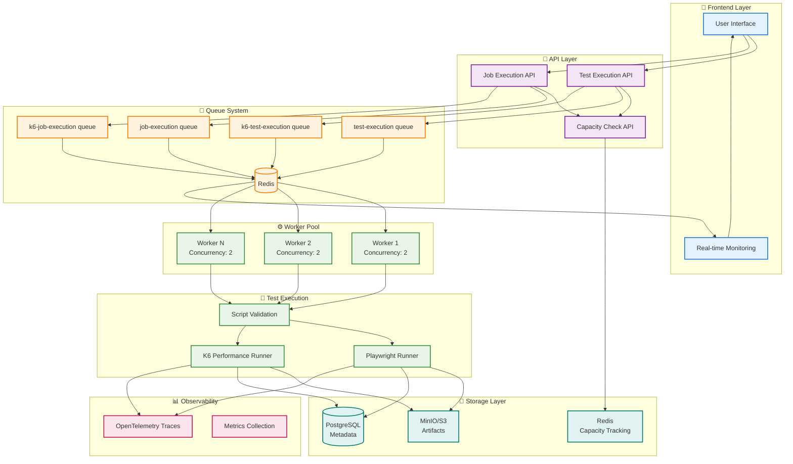
```mermaid
graph TB
    subgraph "🎨 Frontend Layer"
        UI[User Interface]
        MONITOR[Real-time Monitoring]
    end

    subgraph "🔐 API Layer"
        API1[Test Execution API]
        API2[Job Execution API]
        API3[Capacity Check API]
    end

    subgraph "📨 Queue System"
        REDIS[(Redis)]
        Q1[test-execution queue]
        Q2[job-execution queue]
        Q3[k6-test-execution queue]
        Q4[k6-job-execution queue]
    end

    subgraph "⚙️ Worker Pool"
        W1[Worker 1<br/>Concurrency: 2]
        W2[Worker 2<br/>Concurrency: 2]
        W3[Worker N<br/>Concurrency: 2]
    end

    subgraph "🔧 Test Execution"
        PLAYWRIGHT[Playwright Runner]
        K6[K6 Performance Runner]
        VALIDATION[Script Validation]
    end

    subgraph "💾 Storage Layer"
        DB[(PostgreSQL<br/>Metadata)]
        S3[MinIO/S3<br/>Artifacts]
        CACHE[Redis<br/>Capacity Tracking]
    end

    subgraph "📊 Observability"
        OTEL[OpenTelemetry Traces]
        METRICS[Metrics Collection]
    end

    UI --> API1 & API2
    API1 & API2 --> API3
    API3 --> CACHE
    API1 --> Q1 & Q3
    API2 --> Q2 & Q4

    Q1 & Q2 & Q3 & Q4 --> REDIS
    REDIS --> W1 & W2 & W3

    W1 & W2 & W3 --> VALIDATION
    VALIDATION --> PLAYWRIGHT & K6

    PLAYWRIGHT & K6 --> S3
    PLAYWRIGHT & K6 --> DB
    PLAYWRIGHT & K6 --> OTEL

    REDIS --> MONITOR
    MONITOR --> UI

    classDef frontend fill:#e3f2fd,stroke:#1976d2,stroke-width:2px
    classDef api fill:#f3e5f5,stroke:#7b1fa2,stroke-width:2px
    classDef queue fill:#fff3e0,stroke:#f57c00,stroke-width:2px
    classDef worker fill:#e8f5e8,stroke:#388e3c,stroke-width:2px
    classDef storage fill:#e0f2f1,stroke:#00796b,stroke-width:2px
    classDef obs fill:#fce4ec,stroke:#c2185b,stroke-width:2px

    class UI,MONITOR frontend
    class API1,API2,API3 api
    class REDIS,Q1,Q2,Q3,Q4 queue
    class W1,W2,W3,PLAYWRIGHT,K6,VALIDATION worker
    class DB,S3,CACHE storage
    class OTEL,METRICS obs
```

## Execution Pipeline

### Complete Test Execution Flow

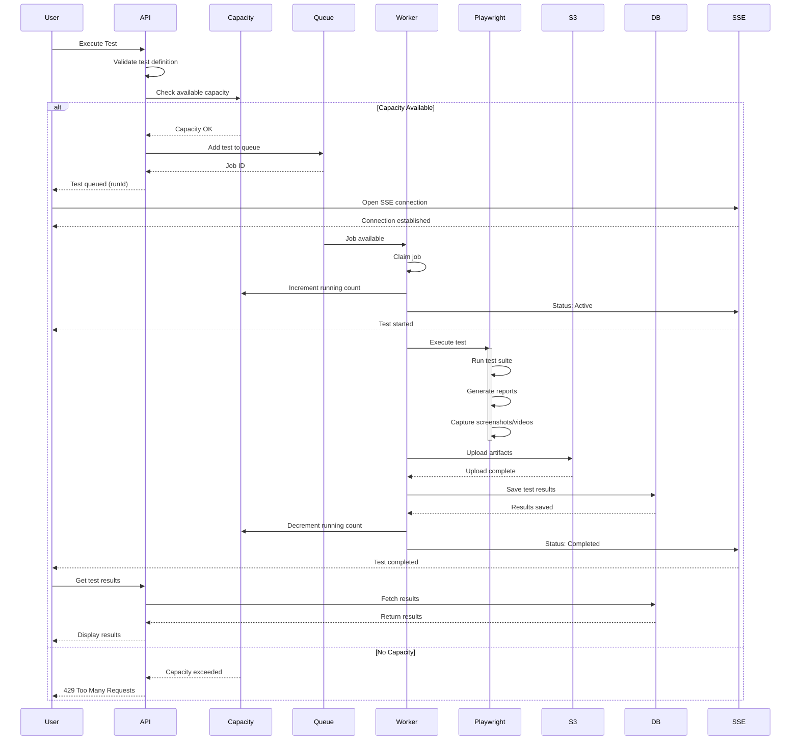
```mermaid
sequenceDiagram
    participant User
    participant API
    participant Capacity
    participant Queue
    participant Worker
    participant Playwright
    participant S3
    participant DB
    participant SSE

    User->>API: Execute Test
    API->>API: Validate test definition
    API->>Capacity: Check available capacity

    alt Capacity Available
        Capacity-->>API: Capacity OK
        API->>Queue: Add test to queue
        Queue-->>API: Job ID
        API-->>User: Test queued (runId)

        User->>SSE: Open SSE connection
        SSE-->>User: Connection established

        Queue->>Worker: Job available
        Worker->>Worker: Claim job
        Worker->>Capacity: Increment running count
        Worker->>SSE: Status: Active
        SSE-->>User: Test started

        Worker->>Playwright: Execute test
        activate Playwright
        Playwright->>Playwright: Run test suite
        Playwright->>Playwright: Generate reports
        Playwright->>Playwright: Capture screenshots/videos
        deactivate Playwright

        Worker->>S3: Upload artifacts
        S3-->>Worker: Upload complete

        Worker->>DB: Save test results
        DB-->>Worker: Results saved

        Worker->>Capacity: Decrement running count
        Worker->>SSE: Status: Completed
        SSE-->>User: Test completed

        User->>API: Get test results
        API->>DB: Fetch results
        DB-->>API: Return results
        API-->>User: Display results

    else No Capacity
        Capacity-->>API: Capacity exceeded
        API-->>User: 429 Too Many Requests
    end
```

### Job Execution Flow (Multiple Tests)

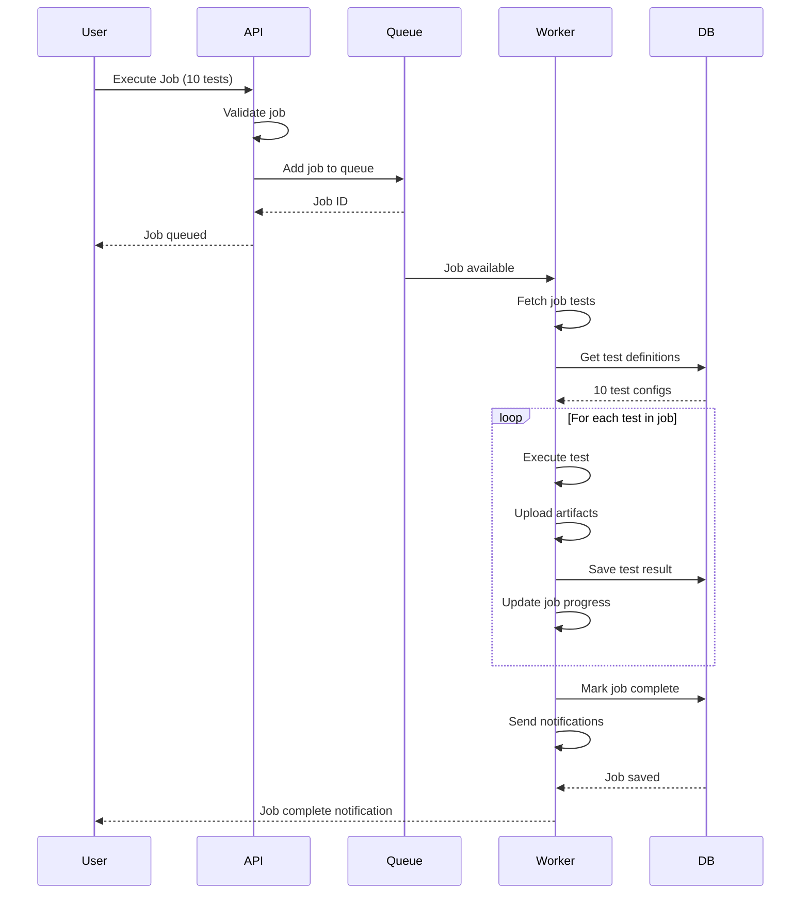
```mermaid
sequenceDiagram
    participant User
    participant API
    participant Queue
    participant Worker
    participant DB

    User->>API: Execute Job (10 tests)
    API->>API: Validate job
    API->>Queue: Add job to queue
    Queue-->>API: Job ID
    API-->>User: Job queued

    Queue->>Worker: Job available
    Worker->>Worker: Fetch job tests
    Worker->>DB: Get test definitions
    DB-->>Worker: 10 test configs

    loop For each test in job
        Worker->>Worker: Execute test
        Worker->>Worker: Upload artifacts
        Worker->>DB: Save test result
        Worker->>Worker: Update job progress
    end

    Worker->>DB: Mark job complete
    Worker->>Worker: Send notifications
    DB-->>Worker: Job saved
    Worker-->>User: Job complete notification
```

## Queue Management

### BullMQ Queue Architecture

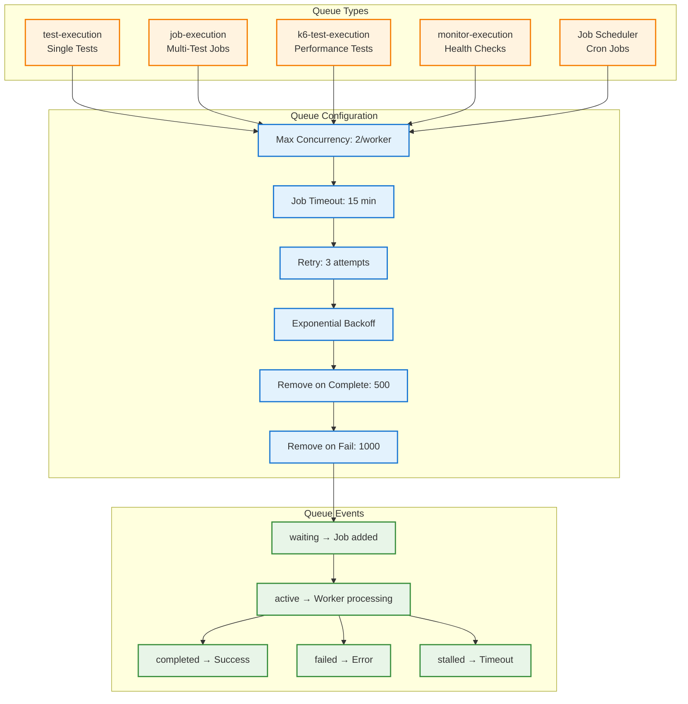
```mermaid
graph TB
    subgraph "Queue Types"
        Q1[test-execution<br/>Single Tests]
        Q2[job-execution<br/>Multi-Test Jobs]
        Q3[k6-test-execution<br/>Performance Tests]
        Q4[monitor-execution<br/>Health Checks]
        Q5[Job Scheduler<br/>Cron Jobs]
    end

    subgraph "Queue Configuration"
        C1[Max Concurrency: 2/worker]
        C2[Job Timeout: 15 min]
        C3[Retry: 3 attempts]
        C4[Exponential Backoff]
        C5[Remove on Complete: 500]
        C6[Remove on Fail: 1000]
    end

    subgraph "Queue Events"
        E1[waiting → Job added]
        E2[active → Worker processing]
        E3[completed → Success]
        E4[failed → Error]
        E5[stalled → Timeout]
    end

    Q1 & Q2 & Q3 & Q4 & Q5 --> C1
    C1 --> C2 --> C3 --> C4 --> C5 --> C6

    C6 --> E1 --> E2 --> E3
    E2 --> E4
    E2 --> E5

    classDef queue fill:#fff3e0,stroke:#f57c00,stroke-width:2px
    classDef config fill:#e3f2fd,stroke:#1976d2,stroke-width:2px
    classDef event fill:#e8f5e8,stroke:#388e3c,stroke-width:2px

    class Q1,Q2,Q3,Q4,Q5 queue
    class C1,C2,C3,C4,C5,C6 config
    class E1,E2,E3,E4,E5 event
```

### Job Lifecycle States

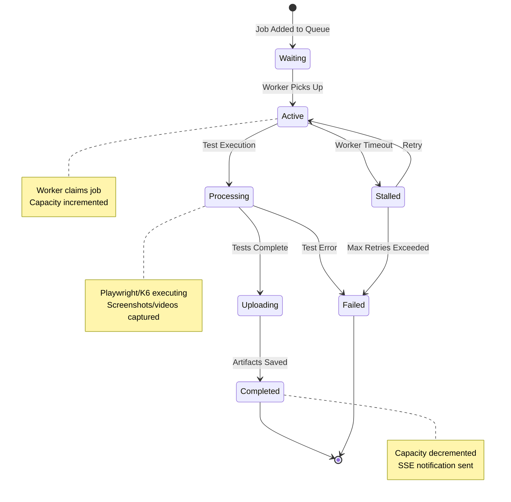
```mermaid
stateDiagram-v2
    [*] --> Waiting: Job Added to Queue
    Waiting --> Active: Worker Picks Up
    Active --> Processing: Test Execution
    Processing --> Uploading: Tests Complete
    Uploading --> Completed: Artifacts Saved
    Processing --> Failed: Test Error
    Active --> Stalled: Worker Timeout
    Stalled --> Active: Retry
    Stalled --> Failed: Max Retries Exceeded
    Completed --> [*]
    Failed --> [*]

    note right of Active
        Worker claims job
        Capacity incremented
    end note

    note right of Processing
        Playwright/K6 executing
        Screenshots/videos captured
    end note

    note right of Completed
        Capacity decremented
        SSE notification sent
    end note
```

## Worker Architecture

### Worker Service Components

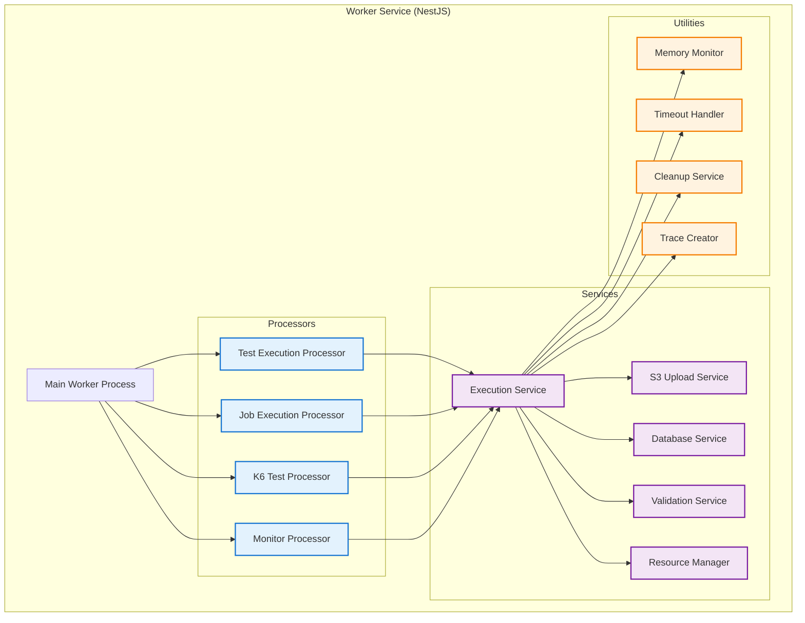
```mermaid
graph TB
    subgraph "Worker Service (NestJS)"
        MAIN[Main Worker Process]

        subgraph "Processors"
            P1[Test Execution Processor]
            P2[Job Execution Processor]
            P3[K6 Test Processor]
            P4[Monitor Processor]
        end

        subgraph "Services"
            S1[Execution Service]
            S2[S3 Upload Service]
            S3[Database Service]
            S4[Validation Service]
            S5[Resource Manager]
        end

        subgraph "Utilities"
            U1[Memory Monitor]
            U2[Timeout Handler]
            U3[Cleanup Service]
            U4[Trace Creator]
        end
    end

    MAIN --> P1 & P2 & P3 & P4
    P1 & P2 --> S1
    P3 --> S1
    P4 --> S1

    S1 --> S2 & S3 & S4 & S5
    S1 --> U1 & U2 & U3 & U4

    classDef processor fill:#e3f2fd,stroke:#1976d2,stroke-width:2px
    classDef service fill:#f3e5f5,stroke:#7b1fa2,stroke-width:2px
    classDef utility fill:#fff3e0,stroke:#f57c00,stroke-width:2px

    class P1,P2,P3,P4 processor
    class S1,S2,S3,S4,S5 service
    class U1,U2,U3,U4 utility
```

### Worker Execution Model

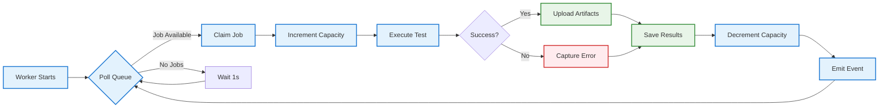
```mermaid
graph LR
    A[Worker Starts] --> B{Poll Queue}
    B -->|Job Available| C[Claim Job]
    B -->|No Jobs| D[Wait 1s]
    D --> B

    C --> E[Increment Capacity]
    E --> F[Execute Test]
    F --> G{Success?}

    G -->|Yes| H[Upload Artifacts]
    G -->|No| I[Capture Error]

    H --> J[Save Results]
    I --> J

    J --> K[Decrement Capacity]
    K --> L[Emit Event]
    L --> B

    classDef success fill:#e8f5e8,stroke:#388e3c,stroke-width:2px
    classDef error fill:#ffebee,stroke:#d32f2f,stroke-width:2px
    classDef process fill:#e3f2fd,stroke:#1976d2,stroke-width:2px

    class H,J success
    class I error
    class A,B,C,E,F,K,L process
```

## Container-Based Execution (Security Isolation)

### Overview

**All test execution (Playwright and K6) runs exclusively in Docker containers** for security isolation. There is no fallback to local execution. This prevents code injection attacks and ensures consistent, reproducible test environments.

### Container Execution Flow

```mermaid
graph TB
    subgraph "Worker Host"
        W[Worker Service]
        M[/workspace Mount<br/>Worker Directory]
        NM[node_modules<br/>Playwright Package]
    end

    subgraph "Docker Container (Isolated)"
        C[Container Executor]
        P[/workspace/node_modules/.bin/playwright]
        B[Pre-installed Browsers<br/>/ms-playwright]
        T[Test Execution]
        R[Report Generation]
    end

    subgraph "Security Boundaries"
        S1[Read-only Root Filesystem]
        S2[No Privilege Escalation]
        S3[Capability Drops]
        S4[Resource Limits]
    end

    W -->|Mount worker dir| M
    M --> NM
    M -->|Volume Mount| C
    C -->|Execute| P
    P -->|Use browsers| B
    P --> T
    T --> R
    R -->|Write to /workspace| M

    C --> S1 & S2 & S3 & S4

    classDef worker fill:#e3f2fd,stroke:#1976d2,stroke-width:2px
    classDef container fill:#fff3e0,stroke:#f57c00,stroke-width:2px
    classDef security fill:#ffebee,stroke:#d32f2f,stroke-width:2px

    class W,M,NM worker
    class C,P,B,T,R container
    class S1,S2,S3,S4 security
```

### Docker Images Used

#### Playwright Container
- **Image**: `mcr.microsoft.com/playwright:v1.56.1-noble`
- **Size**: ~1.9 GB (cached after first pull)
- **Includes**:
  - Pre-installed browsers (Chromium, Firefox, WebKit) at `/ms-playwright`
  - All browser dependencies (fonts, libraries, codecs)
  - Node.js runtime
- **Volume Mount**: Worker directory → `/workspace`
- **Binary**: Uses `/workspace/node_modules/.bin/playwright` (from package.json)
- **Environment**: `PLAYWRIGHT_BROWSERS_PATH=/ms-playwright`

#### K6 Container
- **Image**: `grafana/k6:latest`
- **Size**: ~109 MB (cached after first pull)
- **Includes**:
  - K6 binary as ENTRYPOINT
  - xk6-dashboard extension for HTML reports
- **Volume Mount**: Script directory → `/workspace`

### Container Security Configuration

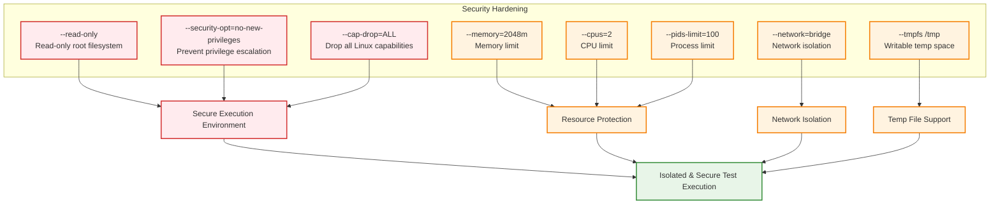
```mermaid
graph TB
    subgraph "Security Hardening"
        S1[--read-only<br/>Read-only root filesystem]
        S2[--security-opt=no-new-privileges<br/>Prevent privilege escalation]
        S3[--cap-drop=ALL<br/>Drop all Linux capabilities]
        S4[--memory=2048m<br/>Memory limit]
        S5[--cpus=2<br/>CPU limit]
        S6[--pids-limit=100<br/>Process limit]
        S7[--network=bridge<br/>Network isolation]
        S8[--tmpfs /tmp<br/>Writable temp space]
    end

    S1 & S2 & S3 --> SEC[Secure Execution Environment]
    S4 & S5 & S6 --> RES[Resource Protection]
    S7 --> NET[Network Isolation]
    S8 --> TMP[Temp File Support]

    SEC & RES & NET & TMP --> SAFE[Isolated & Secure Test Execution]

    classDef security fill:#ffebee,stroke:#d32f2f,stroke-width:2px
    classDef resource fill:#fff3e0,stroke:#f57c00,stroke-width:2px
    classDef result fill:#e8f5e8,stroke:#388e3c,stroke-width:2px

    class S1,S2,S3,SEC security
    class S4,S5,S6,S7,S8,RES,NET,TMP resource
    class SAFE result
```

### Path Mapping (Host → Container)

| Host Path | Container Path | Purpose |
|-----------|---------------|---------|
| `/Users/..../worker` | `/workspace` | Worker root directory |
| `/Users/..../worker/node_modules` | `/workspace/node_modules` | Playwright package & binary |
| `/Users/..../worker/playwright-reports/xxx` | `/workspace/playwright-reports/xxx` | Test execution directory |
| `/Users/..../worker/playwright.config.js` | `/workspace/playwright.config.js` | Playwright configuration |
| N/A (Docker image) | `/ms-playwright` | Pre-installed browsers |

### Why Package.json Still Needs Playwright

**Q: Don't we get Playwright from the Docker image?**

**A: No!** The Docker image provides **browsers**, not the npm package:

```mermaid
graph LR
    subgraph "Docker Image Provides"
        I1[Pre-installed Browsers]
        I2[Browser Dependencies]
        I3[Node.js Runtime]
    end

    subgraph "package.json Provides"
        P1[Playwright npm Package]
        P2[playwright CLI Binary]
        P3[@playwright/test Framework]
        P4[TypeScript Types]
    end

    subgraph "How They Work Together"
        W[Worker installs from package.json]
        W --> M[node_modules mounted in container]
        M --> E[Execute /workspace/node_modules/.bin/playwright]
        E --> B[Use browsers from /ms-playwright]
    end

    I1 & I2 & I3 --> B
    P1 & P2 & P3 & P4 --> E

    classDef image fill:#e3f2fd,stroke:#1976d2,stroke-width:2px
    classDef package fill:#f3e5f5,stroke:#7b1fa2,stroke-width:2px
    classDef execution fill:#e8f5e8,stroke:#388e3c,stroke-width:2px

    class I1,I2,I3 image
    class P1,P2,P3,P4 package
    class W,M,E,B execution
```

**Required dependencies in package.json:**
- ✅ `playwright: ^1.56.0` - Core package with CLI
- ✅ `@playwright/test: ^1.56.0` - Test framework

### Image Caching Behavior

**Q: Are images downloaded on every execution?**

**A: No!** Docker caches images locally:

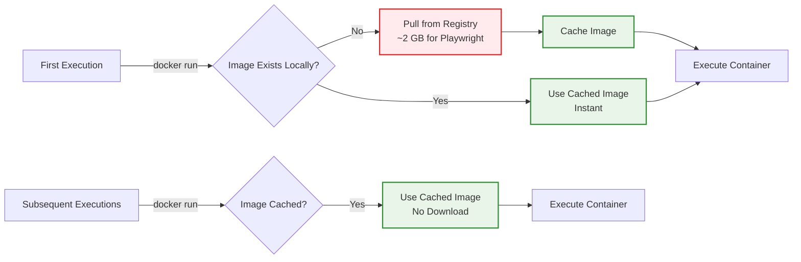
```mermaid
graph LR
    A[First Execution] -->|docker run| B{Image Exists Locally?}
    B -->|No| C[Pull from Registry<br/>~2 GB for Playwright]
    B -->|Yes| D[Use Cached Image<br/>Instant]
    C --> E[Cache Image]
    E --> F[Execute Container]
    D --> F

    G[Subsequent Executions] -->|docker run| H{Image Cached?}
    H -->|Yes| I[Use Cached Image<br/>No Download]
    I --> J[Execute Container]

    classDef download fill:#ffebee,stroke:#d32f2f,stroke-width:2px
    classDef cached fill:#e8f5e8,stroke:#388e3c,stroke-width:2px

    class C download
    class D,E,I cached
```

**Cache invalidation:**
- Images are only re-downloaded when:
  - Image tag changes (e.g., `v1.56.0` → `v1.57.0`)
  - Manual pull: `docker pull <image>`
  - Image removed: `docker rmi <image>`

### Container Execution Performance

| Metric | Value | Notes |
|--------|-------|-------|
| Image pull (first time) | 60-120s | Playwright: ~1.9 GB, K6: ~109 MB |
| Image pull (cached) | 0s | Instant - uses local cache |
| Container startup | <1s | Very fast after first pull |
| Test execution overhead | <100ms | Negligible compared to test duration |
| Container cleanup | <500ms | Automatic with `--rm` flag |

## Parallel Execution

### Concurrency Control

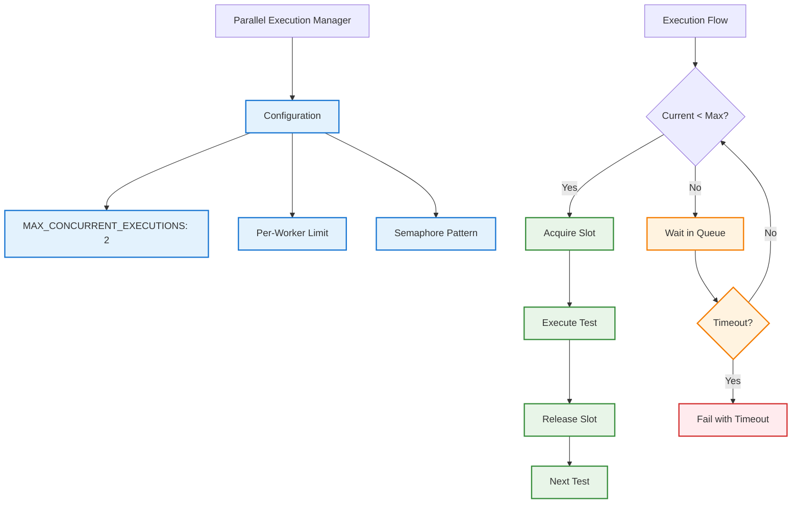
```mermaid
graph TB
    A[Parallel Execution Manager] --> B[Configuration]

    B --> C[MAX_CONCURRENT_EXECUTIONS: 2]
    B --> D[Per-Worker Limit]
    B --> E[Semaphore Pattern]

    F[Execution Flow] --> G{Current < Max?}
    G -->|Yes| H[Acquire Slot]
    G -->|No| I[Wait in Queue]

    H --> J[Execute Test]
    J --> K[Release Slot]
    K --> L[Next Test]

    I --> M{Timeout?}
    M -->|No| G
    M -->|Yes| N[Fail with Timeout]

    classDef config fill:#e3f2fd,stroke:#1976d2,stroke-width:2px
    classDef exec fill:#e8f5e8,stroke:#388e3c,stroke-width:2px
    classDef wait fill:#fff3e0,stroke:#f57c00,stroke-width:2px
    classDef error fill:#ffebee,stroke:#d32f2f,stroke-width:2px

    class B,C,D,E config
    class H,J,K,L exec
    class I,M wait
    class N error
```

### Resource Allocation

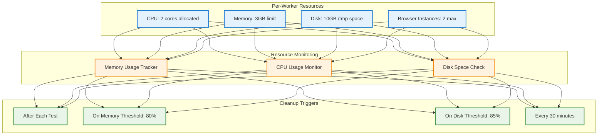
```mermaid
graph TB
    subgraph "Per-Worker Resources"
        R1[CPU: 2 cores allocated]
        R2[Memory: 3GB limit]
        R3[Disk: 10GB /tmp space]
        R4[Browser Instances: 2 max]
    end

    subgraph "Resource Monitoring"
        M1[Memory Usage Tracker]
        M2[CPU Usage Monitor]
        M3[Disk Space Check]
    end

    subgraph "Cleanup Triggers"
        C1[After Each Test]
        C2[On Memory Threshold: 80%]
        C3[On Disk Threshold: 85%]
        C4[Every 30 minutes]
    end

    R1 & R2 & R3 & R4 --> M1 & M2 & M3
    M1 & M2 & M3 --> C1 & C2 & C3 & C4

    classDef resource fill:#e3f2fd,stroke:#1976d2,stroke-width:2px
    classDef monitor fill:#fff3e0,stroke:#f57c00,stroke-width:2px
    classDef cleanup fill:#e8f5e8,stroke:#388e3c,stroke-width:2px

    class R1,R2,R3,R4 resource
    class M1,M2,M3 monitor
    class C1,C2,C3,C4 cleanup
```

## Capacity Management

### Global Capacity Tracking

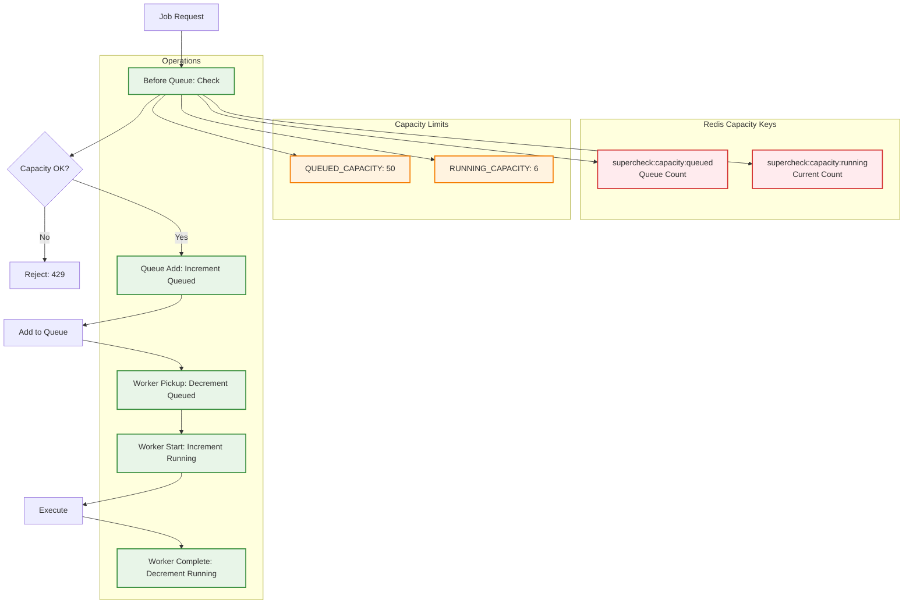
```mermaid
graph TB
    subgraph "Redis Capacity Keys"
        K1[supercheck:capacity:running<br/>Current Count]
        K2[supercheck:capacity:queued<br/>Queue Count]
    end

    subgraph "Capacity Limits"
        L1[RUNNING_CAPACITY: 6]
        L2[QUEUED_CAPACITY: 50]
    end

    subgraph "Operations"
        O1[Before Queue: Check]
        O2[Worker Start: Increment Running]
        O3[Worker Complete: Decrement Running]
        O4[Queue Add: Increment Queued]
        O5[Worker Pickup: Decrement Queued]
    end

    A[Job Request] --> O1
    O1 --> K1 & K2
    O1 --> L1 & L2

    O1 --> D{Capacity OK?}
    D -->|Yes| O4
    D -->|No| E[Reject: 429]

    O4 --> F[Add to Queue]
    F --> O5
    O5 --> O2
    O2 --> G[Execute]
    G --> O3

    classDef redis fill:#ffebee,stroke:#d32f2f,stroke-width:2px
    classDef limit fill:#fff3e0,stroke:#f57c00,stroke-width:2px
    classDef op fill:#e8f5e8,stroke:#388e3c,stroke-width:2px

    class K1,K2 redis
    class L1,L2 limit
    class O1,O2,O3,O4,O5 op
```

### Capacity Decision Flow

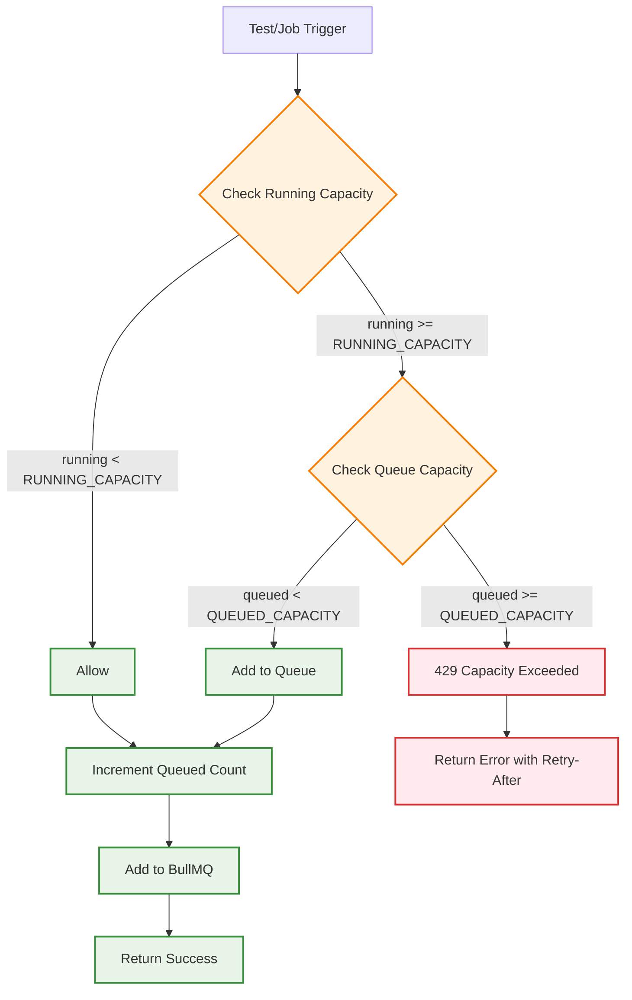
```mermaid
graph TB
    A[Test/Job Trigger] --> B{Check Running Capacity}
    B -->|running < RUNNING_CAPACITY| C[Allow]
    B -->|running >= RUNNING_CAPACITY| D{Check Queue Capacity}

    D -->|queued < QUEUED_CAPACITY| E[Add to Queue]
    D -->|queued >= QUEUED_CAPACITY| F[429 Capacity Exceeded]

    C --> G[Increment Queued Count]
    E --> G
    G --> H[Add to BullMQ]
    H --> I[Return Success]

    F --> J[Return Error with Retry-After]

    classDef success fill:#e8f5e8,stroke:#388e3c,stroke-width:2px
    classDef check fill:#fff3e0,stroke:#f57c00,stroke-width:2px
    classDef error fill:#ffebee,stroke:#d32f2f,stroke-width:2px

    class C,E,G,H,I success
    class B,D check
    class F,J error
```

## Artifact Storage

### Storage Architecture

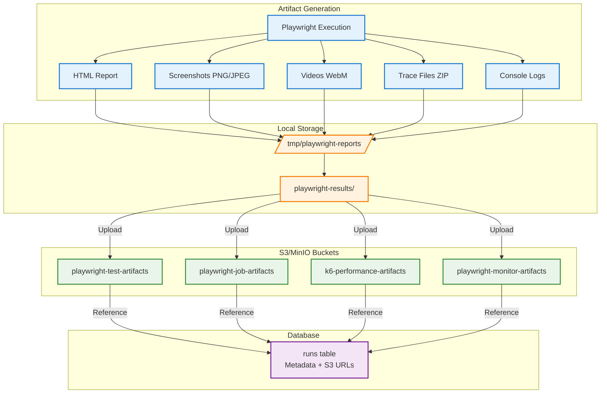
```mermaid
graph TB
    subgraph "Artifact Generation"
        A1[Playwright Execution]
        A2[HTML Report]
        A3[Screenshots PNG/JPEG]
        A4[Videos WebM]
        A5[Trace Files ZIP]
        A6[Console Logs]
    end

    subgraph "Local Storage"
        L1[/tmp/playwright-reports/]
        L2[playwright-results/]
    end

    subgraph "S3/MinIO Buckets"
        S1[playwright-test-artifacts]
        S2[playwright-job-artifacts]
        S3[k6-performance-artifacts]
        S4[playwright-monitor-artifacts]
    end

    subgraph "Database"
        D1[runs table<br/>Metadata + S3 URLs]
    end

    A1 --> A2 & A3 & A4 & A5 & A6
    A2 & A3 & A4 & A5 & A6 --> L1
    L1 --> L2

    L2 -->|Upload| S1 & S2 & S3 & S4
    S1 & S2 & S3 & S4 -->|Reference| D1

    classDef gen fill:#e3f2fd,stroke:#1976d2,stroke-width:2px
    classDef local fill:#fff3e0,stroke:#f57c00,stroke-width:2px
    classDef s3 fill:#e8f5e8,stroke:#388e3c,stroke-width:2px
    classDef db fill:#f3e5f5,stroke:#7b1fa2,stroke-width:2px

    class A1,A2,A3,A4,A5,A6 gen
    class L1,L2 local
    class S1,S2,S3,S4 s3
    class D1 db
```

### Upload Pipeline

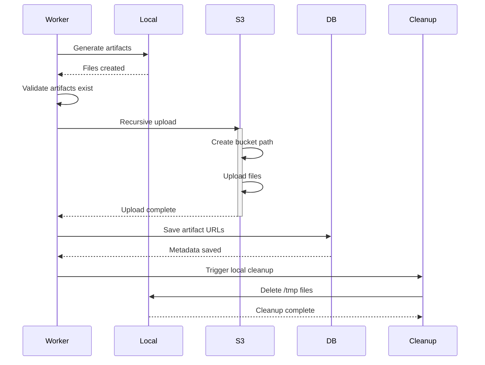
```mermaid
sequenceDiagram
    participant Worker
    participant Local
    participant S3
    participant DB
    participant Cleanup

    Worker->>Local: Generate artifacts
    Local-->>Worker: Files created

    Worker->>Worker: Validate artifacts exist
    Worker->>S3: Recursive upload
    activate S3
    S3->>S3: Create bucket path
    S3->>S3: Upload files
    S3-->>Worker: Upload complete
    deactivate S3

    Worker->>DB: Save artifact URLs
    DB-->>Worker: Metadata saved

    Worker->>Cleanup: Trigger local cleanup
    Cleanup->>Local: Delete /tmp files
    Local-->>Cleanup: Cleanup complete
```

## Error Handling

### Error Recovery Strategy

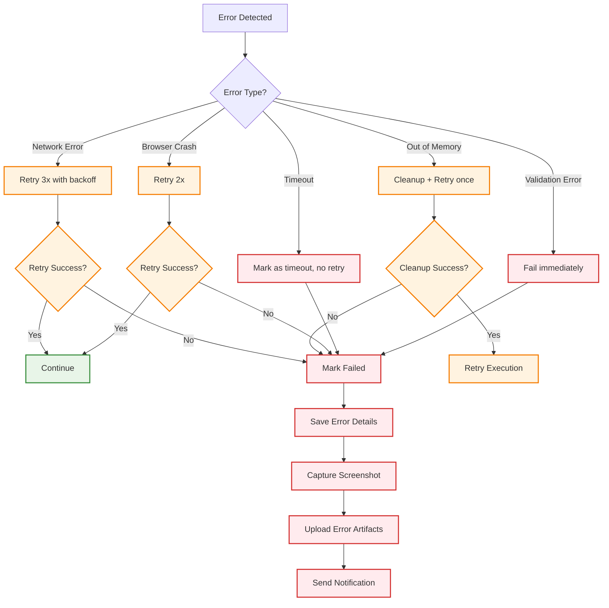
```mermaid
graph TB
    A[Error Detected] --> B{Error Type?}

    B -->|Network Error| C[Retry 3x with backoff]
    B -->|Timeout| D[Mark as timeout, no retry]
    B -->|Out of Memory| E[Cleanup + Retry once]
    B -->|Validation Error| F[Fail immediately]
    B -->|Browser Crash| G[Retry 2x]

    C --> H{Retry Success?}
    H -->|Yes| I[Continue]
    H -->|No| J[Mark Failed]

    E --> K{Cleanup Success?}
    K -->|Yes| L[Retry Execution]
    K -->|No| J

    G --> M{Retry Success?}
    M -->|Yes| I
    M -->|No| J

    D --> J
    F --> J

    J --> N[Save Error Details]
    N --> O[Capture Screenshot]
    O --> P[Upload Error Artifacts]
    P --> Q[Send Notification]

    classDef retry fill:#fff3e0,stroke:#f57c00,stroke-width:2px
    classDef success fill:#e8f5e8,stroke:#388e3c,stroke-width:2px
    classDef fail fill:#ffebee,stroke:#d32f2f,stroke-width:2px

    class C,E,G,H,K,L,M retry
    class I success
    class D,F,J,N,O,P,Q fail
```

### Timeout Management

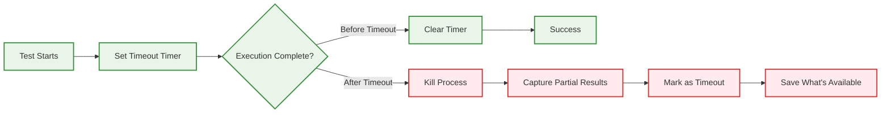
```mermaid
graph LR
    A[Test Starts] --> B[Set Timeout Timer]
    B --> C{Execution Complete?}

    C -->|Before Timeout| D[Clear Timer]
    C -->|After Timeout| E[Kill Process]

    D --> F[Success]

    E --> G[Capture Partial Results]
    G --> H[Mark as Timeout]
    H --> I[Save What's Available]

    classDef normal fill:#e8f5e8,stroke:#388e3c,stroke-width:2px
    classDef timeout fill:#ffebee,stroke:#d32f2f,stroke-width:2px

    class A,B,C,D,F normal
    class E,G,H,I timeout
```

## Performance Optimization

### Optimization Strategies

```mermaid
graph TB
    subgraph "Queue Optimization"
        Q1[Job Priority Levels]
        Q2[Batch Test Execution]
        Q3[Intelligent Retry Logic]
    end

    subgraph "Execution Optimization"
        E1[Browser Instance Reuse]
        E2[Parallel Test Execution]
        E3[Headless Mode Default]
        E4[Trace on Failure Only]
    end

    subgraph "Storage Optimization"
        S1[Compress Screenshots]
        S2[Stream Large Files]
        S3[Cleanup Old Artifacts]
        S4[Incremental Uploads]
    end

    subgraph "Resource Optimization"
        R1[Memory Pool Management]
        R2[CPU Affinity]
        R3[Disk Space Monitoring]
        R4[Network Bandwidth Control]
    end

    Q1 & Q2 & Q3 --> PERF[Performance Gains]
    E1 & E2 & E3 & E4 --> PERF
    S1 & S2 & S3 & S4 --> PERF
    R1 & R2 & R3 & R4 --> PERF

    PERF --> RESULT[50% Faster Execution<br/>30% Lower Resource Usage]

    classDef opt fill:#e3f2fd,stroke:#1976d2,stroke-width:2px
    classDef result fill:#e8f5e8,stroke:#388e3c,stroke-width:2px

    class Q1,Q2,Q3,E1,E2,E3,E4,S1,S2,S3,S4,R1,R2,R3,R4 opt
    class RESULT result
```

### Key Performance Metrics

| Metric | Target | Current | Status |
|--------|--------|---------|--------|
| Queue Wait Time | < 30s | 15s avg | ✅ |
| Test Execution Time | < 2 min | 1.5 min avg | ✅ |
| Artifact Upload Time | < 10s | 8s avg | ✅ |
| Worker Utilization | 70-80% | 75% avg | ✅ |
| Memory per Test | < 500MB | 380MB avg | ✅ |
| Concurrent Tests | 12 (6 workers × 2) | 12 | ✅ |

## Configuration Reference

### Environment Variables

**Capacity Configuration:**
- `RUNNING_CAPACITY` - Maximum concurrent executions (default: 6)
- `QUEUED_CAPACITY` - Maximum queued jobs (default: 50)
- `MAX_CONCURRENT_EXECUTIONS` - Per-worker concurrency (default: 2)

**Timeout Configuration:**
- `TEST_EXECUTION_TIMEOUT_MS` - Single test timeout (default: 120000 = 2 min)
- `JOB_EXECUTION_TIMEOUT_MS` - Job timeout (default: 900000 = 15 min)

**Playwright Configuration:**
- `PLAYWRIGHT_HEADLESS` - Run headless (default: true)
- `PLAYWRIGHT_RETRIES` - Retry count (default: 1)
- `PLAYWRIGHT_TRACE` - Trace mode (default: retain-on-failure)

**Resource Configuration:**
- `WORKER_MEMORY_LIMIT` - Memory limit (default: 3GB)
- `CLEANUP_INTERVAL_MS` - Cleanup frequency (default: 1800000 = 30 min)

## Best Practices

### For High Throughput
1. Scale workers horizontally (not concurrency per worker)
2. Use job priority for critical tests
3. Implement test result caching
4. Optimize Playwright test selectors

### For Reliability
1. Implement comprehensive error handling
2. Use idempotent job processing
3. Enable detailed logging and tracing
4. Monitor queue health metrics

### For Resource Efficiency
1. Clean up artifacts regularly
2. Use headless mode by default
3. Limit screenshot/video capture
4. Implement memory monitoring

## Related Documentation

- **Queue System:** See `REAL_TIME_STATUS_UPDATES_SSE.md` for SSE integration
- **Job Triggers:** See `JOB_TRIGGER_SYSTEM.md` for trigger types
- **Observability:** See `OBSERVABILITY.md` for tracing details
- **API Keys:** See `API_KEY_SYSTEM.md` for remote triggers

## Revision History

| Version | Date | Changes |
|---------|------|---------|
| 2.0 | 2025-01-12 | Complete rewrite with comprehensive diagrams |
| 1.0 | 2024-09-15 | Initial test execution specification |
