# Test Execution and Job Queue Flow Specification

## Overview

The Supercheck test execution system provides a distributed, scalable architecture for running Playwright and K6 performance tests. The system uses **BullMQ** job queues, **worker pools** for parallel execution, and **capacity management** to ensure reliable test execution at scale while maintaining resource efficiency.

## Table of Contents

1. [System Architecture](#system-architecture)
2. [Execution Pipeline](#execution-pipeline)
3. [Queue Management](#queue-management)
4. [Worker Architecture](#worker-architecture)
5. [Parallel Execution](#parallel-execution)
6. [Capacity Management](#capacity-management)
7. [Artifact Storage](#artifact-storage)
8. [Error Handling](#error-handling)
9. [Performance Optimization](#performance-optimization)

## System Architecture

## Execution Pipeline

### Complete Test Execution Flow

### Job Execution Flow (Multiple Tests)

## Queue Management

### BullMQ Queue Architecture

```mermaid
graph TB
    subgraph "Queue Types"
        Q1[test-execution<br/>Single Tests]
        Q2[job-execution<br/>Multi-Test Jobs]
        Q3[k6-test-execution<br/>Performance Tests]
        Q4[monitor-execution<br/>Health Checks]
        Q5[Job Scheduler<br/>Cron Jobs]
    end

    subgraph "Queue Configuration"
        C1[Max Concurrency: 2/worker]
        C2[Job Timeout: 15 min]
        C3[Retry: 3 attempts]
        C4[Exponential Backoff]
        C5[Remove on Complete: 500]
        C6[Remove on Fail: 1000]
    end

    subgraph "Queue Events"
        E1[waiting → Job added]
        E2[active → Worker processing]
        E3[completed → Success]
        E4[failed → Error]
        E5[stalled → Timeout]
    end

    Q1 & Q2 & Q3 & Q4 & Q5 --> C1
    C1 --> C2 --> C3 --> C4 --> C5 --> C6

    C6 --> E1 --> E2 --> E3
    E2 --> E4
    E2 --> E5

    classDef queue fill:#fff3e0,stroke:#f57c00,stroke-width:2px
    classDef config fill:#e3f2fd,stroke:#1976d2,stroke-width:2px
    classDef event fill:#e8f5e8,stroke:#388e3c,stroke-width:2px

    class Q1,Q2,Q3,Q4,Q5 queue
    class C1,C2,C3,C4,C5,C6 config
    class E1,E2,E3,E4,E5 event
```

### Job Lifecycle States

## Worker Architecture

### Worker Service Components

### Worker Execution Model

## Parallel Execution

### Concurrency Control

### Resource Allocation

## Capacity Management

### Global Capacity Tracking

### Capacity Decision Flow

## Artifact Storage

### Storage Architecture

### Upload Pipeline

## Error Handling

### Error Recovery Strategy

### Timeout Management

## Performance Optimization

### Optimization Strategies

### Key Performance Metrics

| Metric | Target | Current | Status |
|--------|--------|---------|--------|
| Queue Wait Time | < 30s | 15s avg | ✅ |
| Test Execution Time | < 2 min | 1.5 min avg | ✅ |
| Artifact Upload Time | < 10s | 8s avg | ✅ |
| Worker Utilization | 70-80% | 75% avg | ✅ |
| Memory per Test | < 500MB | 380MB avg | ✅ |
| Concurrent Tests | 12 (6 workers × 2) | 12 | ✅ |

## Configuration Reference

### Environment Variables

**Capacity Configuration:**
- `RUNNING_CAPACITY` - Maximum concurrent executions (default: 6)
- `QUEUED_CAPACITY` - Maximum queued jobs (default: 50)
- `MAX_CONCURRENT_EXECUTIONS` - Per-worker concurrency (default: 2)

**Timeout Configuration:**
- `TEST_EXECUTION_TIMEOUT_MS` - Single test timeout (default: 120000 = 2 min)
- `JOB_EXECUTION_TIMEOUT_MS` - Job timeout (default: 900000 = 15 min)

**Playwright Configuration:**
- `PLAYWRIGHT_HEADLESS` - Run headless (default: true)
- `PLAYWRIGHT_RETRIES` - Retry count (default: 1)
- `PLAYWRIGHT_TRACE` - Trace mode (default: retain-on-failure)

**Resource Configuration:**
- `WORKER_MEMORY_LIMIT` - Memory limit (default: 3GB)
- `CLEANUP_INTERVAL_MS` - Cleanup frequency (default: 1800000 = 30 min)

## Best Practices

### For High Throughput
1. Scale workers horizontally (not concurrency per worker)
2. Use job priority for critical tests
3. Implement test result caching
4. Optimize Playwright test selectors

### For Reliability
1. Implement comprehensive error handling
2. Use idempotent job processing
3. Enable detailed logging and tracing
4. Monitor queue health metrics

### For Resource Efficiency
1. Clean up artifacts regularly
2. Use headless mode by default
3. Limit screenshot/video capture
4. Implement memory monitoring

## Related Documentation

- **Queue System:** See `REAL_TIME_STATUS_UPDATES_SSE.md` for SSE integration
- **Job Triggers:** See `JOB_TRIGGER_SYSTEM.md` for trigger types
- **Observability:** See `OBSERVABILITY.md` for tracing details
- **API Keys:** See `API_KEY_SYSTEM.md` for remote triggers

## Revision History

| Version | Date | Changes |
|---------|------|---------|
| 2.0 | 2025-01-12 | Complete rewrite with comprehensive diagrams |
| 1.0 | 2024-09-15 | Initial test execution specification |
