# Test Execution and Job Queue Flow Specification

## Overview

The Supercheck test execution system provides a **distributed, secure, and scalable architecture** for running Playwright and K6 performance tests. The system uses **BullMQ** job queues, **container-based execution** for security isolation, and **horizontal scaling** for high throughput.

**🔒 Security-First Design:** All test execution runs in isolated Docker containers with comprehensive security boundaries, preventing code injection attacks and ensuring complete isolation from the host system.

## Table of Contents

1. [System Architecture](#system-architecture)
2. [Container-Based Execution](#container-based-execution)
3. [Execution Pipeline](#execution-pipeline)
4. [Queue Management](#queue-management)
5. [Worker Architecture](#worker-architecture)
6. [Resource Limits & Management](#resource-limits--management)
7. [Docker Compose Best Practices](#docker-compose-best-practices)
8. [Performance Optimization](#performance-optimization)
9. [Monitoring & Observability](#monitoring--observability)

## System Architecture


## Container-Based Execution (Security Isolation)

### Overview

**All test execution (Playwright and K6) runs exclusively in Docker containers** for security isolation. There is no fallback to local execution. This prevents code injection attacks and ensures consistent, reproducible test environments.

### Container Execution Flow


### Docker Images Used

#### Playwright Container
- **Image**: `mcr.microsoft.com/playwright:v1.56.1-noble`
- **Size**: ~1.9 GB (cached after first pull)
- **Includes**:
  - Pre-installed browsers (Chromium, Firefox, WebKit) at `/ms-playwright`
  - All browser dependencies (fonts, libraries, codecs)
  - Node.js runtime
- **Volume Mount**: Worker directory → `/workspace`
- **Binary**: Uses `/workspace/node_modules/.bin/playwright` (from package.json)
- **Environment**: `PLAYWRIGHT_BROWSERS_PATH=/ms-playwright`

#### K6 Container
- **Image**: `grafana/k6:latest`
- **Size**: ~109 MB (cached after first pull)
- **Includes**:
  - K6 binary as ENTRYPOINT
  - xk6-dashboard extension for HTML reports
- **Volume Mount**: Script directory → `/workspace`

### Container Security Configuration


### Path Mapping (Host → Container)

**Container-Only Execution: Minimal Host Mounts (Read-Only)**

| Host Path | Container Path | Mount Type | Purpose |
|-----------|---------------|------------|---------|
| `/Users/..../worker/node_modules` | `/workspace/node_modules` | Read-only | Playwright package & binary |
| `/Users/..../worker/playwright.config.js` | `/workspace/playwright.config.js` | Read-only | Playwright configuration |
| N/A (Docker image) | `/ms-playwright` | Built-in | Pre-installed browsers |
| N/A (inline script) | `/tmp/*.spec.mjs` | In-container | Test scripts (base64-decoded) |
| N/A (container) | `/tmp/playwright-reports/` | In-container | Test execution reports (regular filesystem) |

**Key Changes:**
- ✅ **No host directory mounts for test files** - Test scripts passed inline
- ✅ **Read-only mounts** - Only node_modules and config (security hardening)
- ✅ **Ephemeral test files** - All test scripts created inside container /tmp
- ✅ **Writable container filesystem** - Allows test script and report generation in `/tmp/`
- ✅ **Report extraction** - `docker cp` used to extract reports before container destruction

### Container Lifecycle Management


**Container-Only Benefits:**
- ✅ No host directory creation/cleanup
- ✅ Automatic container destruction handles internal cleanup
- ✅ Only extracted reports need cleanup (in OS temp)
- ✅ True isolation - test files never touch host persistent storage


## Execution Pipeline

### Complete Test Execution Flow


### Container Spawning Flow


### Job Execution Flow (Multiple Tests)


## Queue Management

### BullMQ Queue Architecture

```mermaid
graph TB
    subgraph "Queue Types"
        Q1[test-execution<br/>Single Tests]
        Q2[job-execution<br/>Multi-Test Jobs]
        Q3[k6-test-execution<br/>Performance Tests]
        Q4[monitor-execution<br/>Health Checks]
        Q5[Job Scheduler<br/>Cron Jobs]
    end

    subgraph "Queue Configuration"
        C1[Max Concurrency: 2/worker]
        C2[Job Timeout: 15 min]
        C3[Retry: 3 attempts]
        C4[Exponential Backoff]
        C5[Remove on Complete: 500]
        C6[Remove on Fail: 1000]
    end

    subgraph "Queue Events"
        E1[waiting → Job added]
        E2[active → Worker processing]
        E3[completed → Success]
        E4[failed → Error]
        E5[stalled → Timeout]
    end

    Q1 & Q2 & Q3 & Q4 & Q5 --> C1
    C1 --> C2 --> C3 --> C4 --> C5 --> C6

    C6 --> E1 --> E2 --> E3
    E2 --> E4
    E2 --> E5

    classDef queue fill:#fff3e0,stroke:#f57c00,stroke-width:2px
    classDef config fill:#e3f2fd,stroke:#1976d2,stroke-width:2px
    classDef event fill:#e8f5e8,stroke:#388e3c,stroke-width:2px

    class Q1,Q2,Q3,Q4,Q5 queue
    class C1,C2,C3,C4,C5,C6 config
    class E1,E2,E3,E4,E5 event
```



### Job Lifecycle States


## Worker Architecture

### Worker Service Components


### Worker Execution Model


## Container-Based Execution (Security Isolation)

### Overview

**All test execution (Playwright and K6) runs exclusively in Docker containers** for security isolation. There is no fallback to local execution. This prevents code injection attacks and ensures consistent, reproducible test environments.

### Container Execution Flow


### Docker Images Used

#### Playwright Container
- **Image**: `mcr.microsoft.com/playwright:v1.56.1-noble`
- **Size**: ~1.9 GB (cached after first pull)
- **Includes**:
  - Pre-installed browsers (Chromium, Firefox, WebKit) at `/ms-playwright`
  - All browser dependencies (fonts, libraries, codecs)
  - Node.js runtime
- **Volume Mount**: Worker directory → `/workspace`
- **Binary**: Uses `/workspace/node_modules/.bin/playwright` (from package.json)
- **Environment**: `PLAYWRIGHT_BROWSERS_PATH=/ms-playwright`

#### K6 Container
- **Image**: `grafana/k6:latest`
- **Size**: ~109 MB (cached after first pull)
- **Includes**:
  - K6 binary as ENTRYPOINT
  - xk6-dashboard extension for HTML reports
- **Volume Mount**: Script directory → `/workspace`

### Container Security Configuration


### Path Mapping (Host → Container)

**Container-Only Execution: Minimal Host Mounts (Read-Only)**

| Host Path | Container Path | Mount Type | Purpose |
|-----------|---------------|------------|---------|
| `/Users/..../worker/node_modules` | `/workspace/node_modules` | Read-only | Playwright package & binary |
| `/Users/..../worker/playwright.config.js` | `/workspace/playwright.config.js` | Read-only | Playwright configuration |
| N/A (Docker image) | `/ms-playwright` | Built-in | Pre-installed browsers |
| N/A (inline script) | `/tmp/*.spec.mjs` | In-container | Test scripts (base64-decoded) |
| N/A (container) | `/tmp/playwright-reports/` | In-container | Test execution reports (regular filesystem) |

**Key Changes:**
- ✅ **No host directory mounts for test files** - Test scripts passed inline
- ✅ **Read-only mounts** - Only node_modules and config (security hardening)
- ✅ **Ephemeral test files** - All test scripts created inside container /tmp
- ✅ **Writable container filesystem** - Allows test script and report generation in `/tmp/`
- ✅ **Report extraction** - `docker cp` used to extract reports before container destruction

### Why Package.json Still Needs Playwright

**Q: Don't we get Playwright from the Docker image?**

**A: No!** The Docker image provides **browsers**, not the npm package:


**Required dependencies in package.json:**
- ✅ `playwright: ^1.56.0` - Core package with CLI
- ✅ `@playwright/test: ^1.56.0` - Test framework

### Image Caching Behavior

**Q: Are images downloaded on every execution?**

**A: No!** Docker caches images locally:


**Cache invalidation:**
- Images are only re-downloaded when:
  - Image tag changes (e.g., `v1.56.0` → `v1.57.0`)
  - Manual pull: `docker pull <image>`
  - Image removed: `docker rmi <image>`

### Container Execution Performance

| Metric | Value | Notes |
|--------|-------|-------|
| Image pull (first time) | 60-120s | Playwright: ~1.9 GB, K6: ~109 MB |
| Image pull (cached) | 0s | Instant - uses local cache |
| Container startup | <1s | Very fast after first pull |
| Test execution overhead | <100ms | Negligible compared to test duration |
| Container cleanup | <500ms | Automatic with `--rm` flag |

## Parallel Execution

### Concurrency Control


### Resource Allocation


## Capacity Management

### Global Capacity Tracking


### Capacity Decision Flow


## Artifact Storage

### Storage Architecture


### Upload Pipeline

```mermaid
sequenceDiagram
    participant Worker
    participant Local
    participant S3
    participant DB
    participant Cleanup

    Worker->>Local: Generate artifacts
    Local-->>Worker: Files created

    Worker->>Worker: Validate artifacts exist
    Worker->>S3: Recursive upload
    activate S3
    S3->>S3: Create bucket path
    S3->>S3: Upload files
    S3-->>Worker: Upload complete
    deactivate S3

    Worker->>DB: Save artifact URLs
    DB-->>Worker: Metadata saved

    Worker->>Cleanup: Trigger local cleanup
    Cleanup->>Local: Delete /tmp files
    Local-->>Cleanup: Cleanup complete
```

## Error Handling

### Error Recovery Strategy

```mermaid
graph TB
    A[Error Detected] --> B{Error Type?}

    B -->|Network Error| C[Retry 3x with backoff]
    B -->|Timeout| D[Mark as timeout, no retry]
    B -->|Out of Memory| E[Cleanup + Retry once]
    B -->|Validation Error| F[Fail immediately]
    B -->|Browser Crash| G[Retry 2x]

    C --> H{Retry Success?}
    H -->|Yes| I[Continue]
    H -->|No| J[Mark Failed]

    E --> K{Cleanup Success?}
    K -->|Yes| L[Retry Execution]
    K -->|No| J

    G --> M{Retry Success?}
    M -->|Yes| I
    M -->|No| J

    D --> J
    F --> J

    J --> N[Save Error Details]
    N --> O[Capture Screenshot]
    O --> P[Upload Error Artifacts]
    P --> Q[Send Notification]

    classDef retry fill:#fff3e0,stroke:#f57c00,stroke-width:2px
    classDef success fill:#e8f5e8,stroke:#388e3c,stroke-width:2px
    classDef fail fill:#ffebee,stroke:#d32f2f,stroke-width:2px

    class C,E,G,H,K,L,M retry
    class I success
    class D,F,J,N,O,P,Q fail
```

### Timeout Management

```mermaid
graph LR
    A[Test Starts] --> B[Set Timeout Timer]
    B --> C{Execution Complete?}

    C -->|Before Timeout| D[Clear Timer]
    C -->|After Timeout| E[Kill Process]

    D --> F[Success]

    E --> G[Capture Partial Results]
    G --> H[Mark as Timeout]
    H --> I[Save What's Available]

    classDef normal fill:#e8f5e8,stroke:#388e3c,stroke-width:2px
    classDef timeout fill:#ffebee,stroke:#d32f2f,stroke-width:2px

    class A,B,C,D,F normal
    class E,G,H,I timeout
```

## Performance Optimization

### Optimization Strategies

```mermaid
graph TB
    subgraph "Queue Optimization"
        Q1[Job Priority Levels]
        Q2[Batch Test Execution]
        Q3[Intelligent Retry Logic]
    end

    subgraph "Execution Optimization"
        E1[Browser Instance Reuse]
        E2[Parallel Test Execution]
        E3[Headless Mode Default]
        E4[Trace on Failure Only]
    end

    subgraph "Storage Optimization"
        S1[Compress Screenshots]
        S2[Stream Large Files]
        S3[Cleanup Old Artifacts]
        S4[Incremental Uploads]
    end

    subgraph "Resource Optimization"
        R1[Memory Pool Management]
        R2[CPU Affinity]
        R3[Disk Space Monitoring]
        R4[Network Bandwidth Control]
    end

    Q1 & Q2 & Q3 --> PERF[Performance Gains]
    E1 & E2 & E3 & E4 --> PERF
    S1 & S2 & S3 & S4 --> PERF
    R1 & R2 & R3 & R4 --> PERF

    PERF --> RESULT["50% Faster Execution<br/>30% Lower Resource Usage"]

    classDef opt fill:#e3f2fd,stroke:#1976d2,stroke-width:2px
    classDef result fill:#e8f5e8,stroke:#388e3c,stroke-width:2px

    class Q1,Q2,Q3,E1,E2,E3,E4,S1,S2,S3,S4,R1,R2,R3,R4 opt
    class RESULT result
```

### Key Performance Metrics

| Metric | Target | Current | Status |
|--------|--------|---------|--------|
| Queue Wait Time | < 30s | 15s avg | ✅ |
| Test Execution Time | < 2 min | 1.5 min avg | ✅ |
| Artifact Upload Time | < 10s | 8s avg | ✅ |
| Worker Utilization | 70-80% | 75% avg | ✅ |
| Memory per Test | < 500MB | 380MB avg | ✅ |
| Concurrent Tests | 5 (default global limit) | 5 | ✅ |

## Configuration Reference

### Environment Variables

**Capacity Configuration:**
- `RUNNING_CAPACITY` - Maximum concurrent executions (default: 5)
- `QUEUED_CAPACITY` - Maximum queued jobs (default: 50)
- `MAX_CONCURRENT_EXECUTIONS` - Per-worker concurrency (default: 5)

> **Note:** These defaults are placeholders. When subscription-aware capacity management ships, limits will be derived from organization settings stored in the database, giving each org its own `RUNNING_CAPACITY`, `QUEUED_CAPACITY`, and per-worker concurrency values.

**Timeout Configuration:**
- `TEST_EXECUTION_TIMEOUT_MS` - Single test timeout (default: 120000 = 2 min)
- `JOB_EXECUTION_TIMEOUT_MS` - Job timeout (default: 900000 = 15 min)

**Playwright Configuration:**
- `PLAYWRIGHT_HEADLESS` - Run headless (default: true)
- `PLAYWRIGHT_RETRIES` - Retry count (default: 1)
- `PLAYWRIGHT_TRACE` - Trace mode (default: retain-on-failure)

**Resource Configuration:**
- `WORKER_MEMORY_LIMIT` - Memory limit (default: 3GB)
- `CLEANUP_INTERVAL_MS` - Cleanup frequency (default: 1800000 = 30 min)

## Resource Limits & Management

### Worker Resource Limits

```yaml
# Worker Container Configuration
worker:
  deploy:
    resources:
      limits:
        cpus: "2.0"          # Max 2 vCPU per worker
        memory: 2G           # Max 2GB RAM per worker
      reservations:
        cpus: "0.5"          # Guaranteed 0.5 vCPU
        memory: 1G           # Guaranteed 1GB RAM
```

### Test Container Resource Limits

```yaml
# Test Execution Container Limits
Container Security:
  memory: 2048m             # 2GB memory limit
  cpus: 2                   # 2 vCPU limit
  pids-limit: 100           # Max 100 processes
  shm-size: 512m            # Shared memory for browsers
  # /tmp uses regular container filesystem (no tmpfs)
  # Allows test scripts and reports to be generated
```

### Resource Allocation Strategy

```mermaid
graph TB
    subgraph "Host Resources (8 vCPU / 16 GB)"
        H1["System: 1 vCPU / 2 GB"]
        H2["PostgreSQL: 0.5 vCPU / 1 GB"]
        H3["Redis: 0.25 vCPU / 256 MB"]
        H4["MinIO: 0.5 vCPU / 1 GB"]
        H5["App: 1 vCPU / 2 GB"]
        H6["Observability: 0.75 vCPU / 1.5 GB"]
        H7["Workers: 4 vCPU / 8 GB"]
    end

    subgraph "Worker Allocation (3 workers)"
        W1["Worker 1: 1.33 vCPU / 2.67 GB"]
        W2["Worker 2: 1.33 vCPU / 2.67 GB"]
        W3["Worker 3: 1.33 vCPU / 2.67 GB"]
    end

    H7 --> W1 & W2 & W3

    classDef system fill:#ffebee,stroke:#d32f2f,stroke-width:2px
    classDef worker fill:#e8f5e8,stroke:#388e3c,stroke-width:2px

    class H1,H2,H3,H4,H5,H6 system
    class W1,W2,W3 worker
```

### Memory Usage Patterns

| Component | Base Memory | Peak Memory | Notes |
|-----------|-------------|-------------|--------|
| Worker Process | ~200 MB | ~500 MB | NestJS runtime |
| Test Container | ~100 MB | ~2 GB | Browser execution |
| Playwright Browser | ~300 MB | ~1.5 GB | Chromium instance |
| K6 Runtime | ~50 MB | ~500 MB | Load testing |
| Report Generation | ~100 MB | ~300 MB | HTML/JSON reports |

### Monitoring Resource Usage

```mermaid
graph LR
    A[Resource Monitor] --> B{Memory > 85%?}
    A --> C{CPU > 90%?}
    A --> D{Disk > 90%?}
    
    B -->|Yes| E[Block New Jobs]
    C -->|Yes| F[Scale Workers Down]
    D -->|Yes| G[Trigger Cleanup]
    
    E --> H[Alert Admin]
    F --> H
    G --> H
    
    classDef alert fill:#ffebee,stroke:#d32f2f,stroke-width:2px
    classDef normal fill:#e8f5e8,stroke:#388e3c,stroke-width:2px
    
    class E,F,G,H alert
```

## Docker Compose Best Practices

### Production Docker Compose Configuration

```yaml
# Production-ready docker-compose.yml
version: '3.8'

# Use YAML anchors for DRY configuration
x-common-env: &common-env
  DATABASE_URL: ${DATABASE_URL}
  REDIS_URL: ${REDIS_URL}
  # ... other common variables

x-healthcheck: &default-healthcheck
  interval: 30s
  timeout: 10s
  retries: 3
  start_period: 60s

x-resource-limits: &default-limits
  cpus: "0.5"
  memory: 512M
  reservations:
    cpus: "0.25"
    memory: 256M

services:
  # App Service
  app:
    image: ghcr.io/supercheck-io/supercheck/app:1.1.3-beta
    restart: unless-stopped
    environment:
      <<: *common-env
    healthcheck:
      <<: *default-healthcheck
      test: ["CMD", "curl", "-f", "http://localhost:3000/health"]
    deploy:
      resources:
        limits:
          cpus: "1.0"
          memory: 2G
        reservations:
          cpus: "0.5"
          memory: 1G
    networks:
      - supercheck-network
    depends_on:
      postgres:
        condition: service_healthy
      redis:
        condition: service_healthy

  # Worker Service - Horizontal Scaling
  worker:
    image: ghcr.io/supercheck-io/supercheck/worker:1.1.3-beta
    restart: unless-stopped
    environment:
      <<: *common-env
      MAX_CONCURRENT_EXECUTIONS: 2  # Keep low, scale horizontally
    volumes:
      - /var/run/docker.sock:/var/run/docker.sock:ro  # Read-only socket
      - worker-reports:/app/reports
    deploy:
      replicas: 3  # Scale horizontally
      resources:
        limits:
          cpus: "2.0"  # Cap individual worker
          memory: 2G
        reservations:
          cpus: "0.5"
          memory: 1G
      restart_policy:
        condition: on-failure
        max_attempts: 3
        delay: 15s
    security_opt:
      - no-new-privileges:true
    cap_drop:
      - ALL
    healthcheck:
      <<: *default-healthcheck
      test: ["CMD", "curl", "-f", "http://localhost:3001/health"]
    networks:
      - supercheck-network

# Network Configuration
networks:
  supercheck-network:
    driver: bridge
    ipam:
      config:
        - subnet: 172.20.0.0/16

# Volume Configuration
volumes:
  postgres-data:
    driver: local
  redis-data:
    driver: local
  worker-reports:
    driver: local
    driver_opts:
      type: none
      o: bind
      device: /tmp/supercheck-reports
```

### Scaling Docker Compose Deployments

```bash
# Scale workers manually
docker-compose up --scale worker=5

# Scale with environment variables
WORKER_REPLICAS=5 docker-compose up

# Update docker-compose.yml for scaling
worker:
  deploy:
    replicas: ${WORKER_REPLICAS:-3}  # Default to 3
```

### Multi-Host Docker Compose

```yaml
# docker-compose.cluster.yml
version: '3.8'

services:
  # Shared services (run once)
  postgres:
    deploy:
      placement:
        constraints:
          - node.hostname == db-host

  redis:
    deploy:
      placement:
        constraints:
          - node.hostname == db-host

  # Worker services (run on all hosts)
  worker:
    deploy:
      mode: replicated
      replicas: 2  # Per host
      placement:
        max_replicas_per_node: 2
```

### Environment-Specific Configurations

```yaml
# docker-compose.override.yml (development)
version: '3.8'
services:
  worker:
    deploy:
      replicas: 1
    volumes:
      - ./worker/src:/app/src:ro  # Mount source for debugging
    environment:
      - NODE_ENV=development
      - LOG_LEVEL=debug

# docker-compose.prod.yml (production)
version: '3.8'
services:
  worker:
    deploy:
      replicas: 5
    environment:
      - NODE_ENV=production
      - LOG_LEVEL=info
    logging:
      driver: "json-file"
      options:
        max-size: "10m"
        max-file: "3"
```

### Best Practices Summary

**🎯 Scaling Best Practices:**
1. **Horizontal over Vertical** - Scale worker count, not individual worker size
2. **Resource Limits** - Always set CPU and memory limits
3. **Health Checks** - Implement comprehensive health monitoring
4. **Restart Policies** - Configure automatic restart on failure
5. **Security Hardening** - Use read-only filesystems and capability drops

**🔧 Docker Compose Best Practices:**
1. **YAML Anchors** - Use anchors for DRY configuration
2. **Environment Variables** - Externalize all configuration
3. **Network Isolation** - Use custom networks
4. **Volume Management** - Use named volumes with proper drivers
5. **Multi-Stage Builds** - Optimize image sizes

**📊 Monitoring Best Practices:**
1. **Resource Monitoring** - Track CPU, memory, and disk usage
2. **Queue Metrics** - Monitor queue depth and processing times
3. **Container Lifecycle** - Track container spawn/cleanup times
4. **Error Rates** - Monitor test failure patterns
5. **Capacity Planning** - Track utilization trends

## Related Documentation

- **Queue System:** See `REAL_TIME_STATUS_UPDATES_SSE.md` for SSE integration
- **Job Triggers:** See `JOB_TRIGGER_SYSTEM.md` for trigger types
- **Observability:** See `OBSERVABILITY.md` for tracing details
- **API Keys:** See `API_KEY_SYSTEM.md` for remote triggers

## Revision History

| Version | Date | Changes |
|---------|------|---------|
| 3.1 | 2025-01-14 | Moved scaling strategies to dedicated SCALING_GUIDE.md, integrated scaling options into Docker Compose files |
| 3.0 | 2025-01-14 | Major update - Container-based execution, scaling strategies, Docker Compose best practices |
| 2.0 | 2025-01-12 | Complete rewrite with comprehensive diagrams |
| 1.0 | 2024-09-15 | Initial test execution specification |
